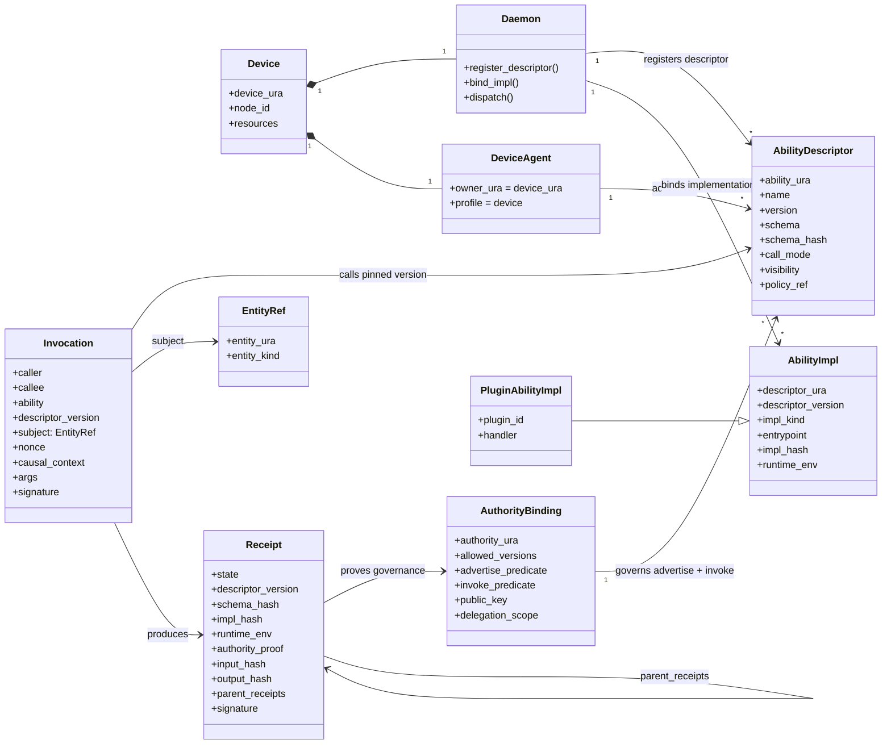

# Ability Control-Plane Model

**Status:** current architecture note.
**Date:** 2026-06-21.
**Scope:** EasyNet device ability model, daemon dispatch, plugin ability binding, invocation, and receipts.

This document supersedes older shorthand such as "agent owns ability" or
"ability is only a method" when discussing the current control-plane model.
Those phrases may still describe the historical L2 EAL typed-dispatch surface,
but they are not precise enough for daemon/plugin/receipt architecture.

## One-Line Model

`AbilityDescriptor` is the governed interface. `AbilityImpl` is the executable
binding. `Receipt` is the versioned, verifiable execution fact.

## Core Terms

| Term | Meaning |
|---|---|
| `Device` | Execution substrate identified by `device_ura`, with `node_id` and local resources. |
| `Daemon` | Projection and dispatch runtime that registers descriptors, binds implementations, dispatches invocations, and emits receipts. |
| `DeviceAgent` | Control-plane identity projection for a device. It advertises descriptors; it does not own authority by itself. |
| `AbilityDescriptor` | Versioned, governed callable interface: name, schema, call mode, visibility, policy, version, and schema hash. |
| `AuthorityBinding` | Governance predicate that authorizes both descriptor advertisement and invocation. |
| `AbilityImpl` | Executable binding for a descriptor version, including entrypoint, implementation hash, and runtime environment. |
| `PluginAbilityImpl` | Local plugin-provided ability implementation loaded and bound by the daemon. |
| `Invocation` | Signed causal call pinned to a descriptor version and an `EntityRef` subject. |
| `Receipt` | Auditable, cryptographically verifiable record of admission, execution, version, implementation, inputs, outputs, and causal parents. |

## Object Model

## Three Planes

### Interface Plane

`AbilityDescriptor` is the stable callable surface. It is the object that can be
advertised, discovered, authorized, invoked, and audited. The daemon registers
descriptors separately from implementations.

Minimum descriptor fields:

- `ability_ura`
- `name`
- `version`
- `schema`
- `schema_hash`
- `call_mode`
- `visibility`
- `policy_ref`

### Authority Plane

`AuthorityBinding` is not a decoration on advertisement. It is the governance
predicate for both:

- whether a descriptor version may be advertised by this projection
- whether this caller may invoke it for this subject under this causal context

The owner/accountability root is `device_ura` or an explicit authority binding.
`DeviceAgent` is a projection of that authority, not the authority source.

### Execution Plane

`AbilityImpl` is the local executable binding. A plugin may provide a
`PluginAbilityImpl`, but plugin loading is not the same as descriptor
registration and not the same as invocation authorization.

Minimum implementation fields:

- `descriptor_ura`
- `descriptor_version`
- `impl_kind`
- `entrypoint`
- `impl_hash`
- `runtime_env`

## Invocation Subject

`Invocation.subject` is an `EntityRef`, not a resource-only pointer. Valid
subjects include:

- resource
- agent
- ability
- session
- continuation
- state object
- the callee itself

This keeps the invocation axiom general enough for resource mutation, session
control, ability management, continuation resumption, and governance actions.

## Receipt Semantics

A receipt is not a return value. It must prove what was admitted, what was run,
which governed interface version was used, which implementation binding
executed, and how the call fits into the causal chain.

Minimum receipt fields:

- `state`
- `descriptor_version`
- `schema_hash`
- `impl_hash`
- `runtime_env`
- `authority_proof`
- `input_hash`
- `output_hash`
- `parent_receipts`
- `signature`

Without `descriptor_version`, `schema_hash`, `impl_hash`, and `runtime_env`, a
receipt cannot prove what was actually invoked at the time of execution.

## Layer Placement

| Concern | Owner |
|---|---|
| Invocation object shape, canonical hashing, signatures, receipt verification, and causal-chain rules | EasyNet-Axon |
| Descriptor projection, local implementation binding, plugin lifecycle, local dispatch, and device policy | EasyNet-Cli daemon |
| Language/FFI access to the daemon process | `libeasynet_cli` and EasyNet-Cli SDK |
| Browser-facing product UX, dashboards, user sessions, and DB-backed product state | EasyNet backend |
| Plugin handler code and local execution adapters | Plugin packages loaded by the daemon |

## Invariants

- Descriptor is not implementation.
- Advertisement is not authority.
- Authority is not execution.
- Invocation is not a raw handler call.
- Receipt is not a return value.
- `DeviceAgent advertises AbilityDescriptor`; it does not own Ability.
- `AuthorityBinding` constrains both advertise and invoke.
- `Daemon.register_descriptor` and `Daemon.bind_impl` are separate operations.
- `Invocation.descriptor_version` must match the descriptor version admitted by policy.
- `Receipt` must bind descriptor version, schema hash, implementation hash, runtime environment, authority proof, input hash, output hash, parent receipts, and signature.

## Anti-Patterns

Reject these designs:

- Treating `DeviceAgent owns Ability` as the formal ownership rule.
- Letting plugin registration implicitly publish a network ability.
- Letting descriptor advertisement imply invocation permission.
- Using `Resource` as the only possible invocation subject.
- Emitting receipts without version and implementation binding.
- Exposing a plugin handler as a product RPC without an AbilityDescriptor.
- Rebuilding descriptor schema or version from local handler metadata at call time.
- Mixing daemon control frames with canonical Axon Invocation construction.

## Code Anchors

The current implementation is still converging on this model. Review these
areas when changing the ability control plane:

- `src/daemon/ability/dispatch.rs`
- `src/daemon/ability/catalog/profiles/device.rs`
- `src/daemon/ability/builtins/`
- `src/runtime/plugin_host/host_api.rs`
- `src/daemon/invocation/`
- `ability-descriptors/system/*.ability.toml`
