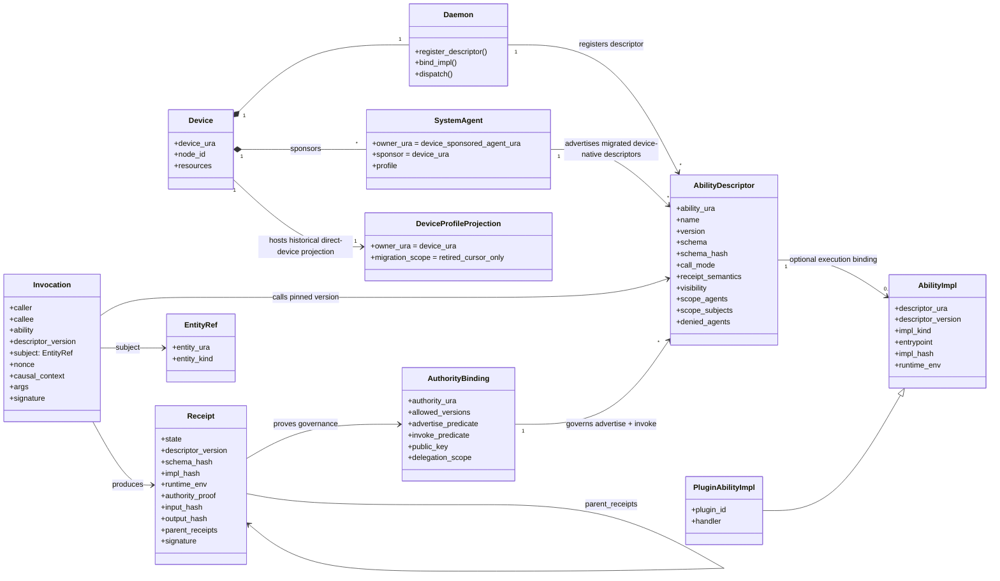

# Ability Control-Plane Model

**Status:** current architecture note.
**Date:** 2026-08-11.
**Scope:** EasyNet device ability model, daemon dispatch, plugin ability binding, invocation, and receipts.

This document supersedes older shorthand such as "agent owns ability" or
"ability is only a method" when discussing the current control-plane model.
Those phrases may still describe the historical L2 EAL typed-dispatch surface,
but they are not precise enough for daemon/plugin/receipt architecture.

## One-Line Model

`AbilityDescriptor` is the governed capability declaration. `AbilityImpl` is
the optional executable binding. A descriptor is invokable only when that
binding exists. `Receipt` is the versioned, verifiable execution fact.

## Core Terms

| Term | Meaning |
|---|---|
| `User / Account` | Authentication and accountability Principal. It can own or authorize actors, but is never a routable Agent, descriptor owner, or invocation callee. |
| `Agent` | Stable, routable logical actor with its own Agent URA and lifecycle. A user-owned Agent may move between Devices without becoming the User account or the Device that hosts it. |
| `Device` | Execution substrate identified by `device_ura`, with `node_id` and local resources. |
| `Daemon` | Projection and dispatch runtime that registers descriptors, binds implementations, dispatches invocations, and emits receipts. |
| `SystemAgent` | Restricted Agent sponsored by a Device for device-native callable surfaces. It owns and advertises migrated device-native descriptors while the Device remains substrate/custodian. |
| `HostedAgentPublication` | Device custody state that binds one user-owned Agent incarnation to its current host and Hub-assigned generation. It is placement/lifecycle state, not account identity or authorization by itself. |
| `IncarnationId` | Device-generated opaque idempotency key persisted before registration network I/O. It identifies one publication attempt and grants no authority. |
| `Generation` | Hub-owned, monotonically increasing fence for one Agent URA. Devices consume an assignment; they never choose a generation. |
| `Authority` | Realm governance actor and routable owner of Authority-native control-plane abilities. |
| `DeviceProfileProjection` | Empty historical/migration cursor for retired direct Device-owned rows. It is not an actor identity and cannot own live descriptors. |
| `AbilityDescriptor` | Versioned, governed capability declaration: identity, schema, call mode, receipt semantics, visibility, allow/deny policy, version, and hashes. It may be discovery-only. |
| `AuthorityBinding` | Governance predicate that authorizes both descriptor advertisement and invocation. |
| `AbilityImpl` | Optional executable binding for a descriptor version, including entrypoint, implementation hash, and runtime environment. |
| `DescriptorOnly` | Explicit control-plane state for a discoverable descriptor with no execution binding. It never creates an execution-index or runtime-handler row. |
| `PluginAbilityImpl` | Local plugin-provided ability implementation loaded and bound by the daemon. |
| `Invocation` | Signed causal call pinned to a descriptor version and an `EntityRef` subject. |
| `Receipt` | Auditable, cryptographically verifiable record of admission, execution, version, implementation, inputs, outputs, and causal parents. |
| `DynamicAbilityDeployment` | Device-hosted deployed implementation whose descriptor is owned by the `ability-management` SystemAgent. The Device is execution host, not public owner/callee. |

## Object Model



## Actor Identity Invariants

- A User/Account authenticates and is accountable; it is not an Agent.
- An Agent is a routable logical actor; its host Device is placement, not identity.
- A SystemAgent is an explicit restricted Agent sponsored by a Device; the
  Device remains execution host and key custodian.
- Public descriptors and callees belong to Agent, SystemAgent, or Authority.
  A Device may appear as host, sponsor, custody principal, or resource subject,
  but not as an ordinary public ability actor.
- `IncarnationId` makes registration retries idempotent. `Generation` fences
  stale lifecycle events. Neither substitutes for caller authorization.

Hosted publication has one legal ordering:

```text
Device: RegistrationPending(incarnation_id)  [durable before network]
   -> Hub: register exact incarnation         [atomically assigns generation]
   -> Device: Active(incarnation_id, generation) [durable assignment]
   -> publish ability projection at that exact generation
   -> revoke/tombstone
   -> Device + Hub: Retired(incarnation_id, generation)
```

The Hub accepts an exact Active replay idempotently, rejects a different token
while Active, rejects a retired-token replay, and allocates `generation + 1`
only for a new token after retirement. Ability projection cannot precede the
durable assignment.

## Three Planes

### Interface Plane

`AbilityDescriptor` is the stable governed surface. Every descriptor can be
advertised and discovered. Authorization and invocation additionally require a
matching `AbilityImpl`; a `DescriptorOnly` row therefore remains intentionally
non-invokable. The daemon registers descriptors separately from implementations.

Minimum descriptor fields:

- `ability_ura`
- `name`
- `version`
- `schema`
- `schema_hash`
- `call_mode`
- `receipt_semantics`
- `visibility`
- caller/subject scope and deny policy

### Authority Plane

`AuthorityBinding` is not a decoration on advertisement. It is the governance
predicate for both:

- whether a descriptor version may be advertised by this projection
- whether this caller may invoke it for this subject under this causal context

The owner/accountability root is a routable Agent/SystemAgent/Service/Authority
identity plus an explicit authority binding. `DeviceProfileProjection` retains
only an empty migration/high-water cursor; it is not a Principal, public callee,
or `AbilityDescriptor` owner.

Principal proof facts use canonical User URAs internally. Serialized
`owner_user_id` and `session_owner_user_id` keys are compatibility names only;
they must not leak into runtime `AuthorityProof` fields as bare account ids or
as Agent identities.

For dynamic/easyremote ability deployment, ownership and execution remain
separate: descriptor `owner_ura` and invocation `callee_ura` resolve to the
device-sponsored `ability-management` SystemAgent, while `target_ura` /
`execution_host_ura` remains the Device. The default daemon-system invocation
subject is the concrete deployed Ability URA; public ingress may provide a more
specific resource or session subject. A User/Account Principal can authorize or
be accountable for the deployment, but it is not converted into an Agent.

### Execution Plane

`AbilityImpl` is the local executable binding. A plugin may provide a
`PluginAbilityImpl`, but plugin loading is not the same as descriptor
registration and not the same as invocation authorization.
Daemon-bound plugin package contributions publish their descriptors through the
device-sponsored `plugin-management` SystemAgent; the plugin package remains an
implementation source and the Device remains only the local execution host.

The canonical control plane contains both executable and descriptor-only rows.
The execution index contains handlers only. Dynamic lifecycle ownership is kept
in a separate catalog index so reconciliation and removal cover both row types
without treating the execution registry as descriptor truth.

Minimum implementation fields:

- `descriptor_ura`
- `descriptor_version`
- `impl_kind`
- `entrypoint`
- `impl_hash`
- `runtime_env`

## Invocation Subject

`Invocation.subject` is an `EntityRef`, not a resource-only pointer. Valid
subjects include:

- resource
- agent
- ability
- session
- continuation
- state object
- the callee itself

This keeps the invocation axiom general enough for resource mutation, session
control, ability management, continuation resumption, and governance actions.

## Receipt Semantics

Transport and state semantics are orthogonal. `CallMode` selects `Rpc`,
`Stream`, or `Bidi`; it never implies a transition. `ReceiptSemantics` is
either operational or a validated state transition with a stable
`<ability>@vN` identity and an operational/canonical transition class.

A receipt is not a return value. It must prove what was admitted, what was run,
which governed interface version was used, which implementation binding
executed, and how the call fits into the causal chain.

Minimum receipt fields:

- `state`
- `descriptor_version`
- `schema_hash`
- `impl_hash`
- `runtime_env`
- `authority_proof`
- `input_hash`
- `output_hash`
- `parent_receipts`
- `signature`

Without `descriptor_version`, `schema_hash`, `impl_hash`, and `runtime_env`, a
receipt cannot prove what was actually invoked at the time of execution.

## Layer Placement

| Concern | Owner |
|---|---|
| Invocation object shape, canonical hashing, signatures, receipt verification, and causal-chain rules | EasyNet-Axon |
| Descriptor projection, local implementation binding, plugin lifecycle, local dispatch, and device policy | EasyNet-Cli daemon |
| Language/FFI access to the daemon process | `libeasynet_cli` and EasyNet-Cli SDK |
| Browser-facing product UX, dashboards, user sessions, and DB-backed product state | EasyNet backend |
| Plugin handler code and local execution adapters | Plugin packages loaded by the daemon |

## Invariants

- Descriptor is not implementation.
- Advertisement is not authority.
- Authority is not execution.
- Invocation is not a raw handler call.
- Receipt is not a return value.
- `SystemAgent advertises migrated device-native AbilityDescriptors`; Device is
  substrate/custody, not ordinary public callee.
- `DeviceProfileProjection` is only an empty historical/migration cursor; the
  live direct Device descriptor inventory is unconditionally empty.
- `AuthorityBinding` constrains both advertise and invoke.
- `Daemon.register_descriptor` and `Daemon.bind_impl` are separate operations.
- `Invocation.descriptor_version` must match the descriptor version admitted by policy.
- `Receipt` must bind descriptor version, schema hash, implementation hash, runtime environment, authority proof, input hash, output hash, parent receipts, and signature.

## Anti-Patterns

Reject these designs:

- Treating Device ownership or a device-profile projection as the formal target
  actor model for ordinary device-native abilities.
- Letting plugin registration implicitly publish a network ability.
- Letting descriptor advertisement imply invocation permission.
- Using `Resource` as the only possible invocation subject.
- Emitting receipts without version and implementation binding.
- Exposing a plugin handler as a product RPC without an AbilityDescriptor.
- Rebuilding descriptor schema or version from local handler metadata at call time.
- Mixing daemon control frames with canonical Axon Invocation construction.

## Code Anchors

These are the current implementation boundaries. Architecture checks must fail
when a new interface, authority, implementation, or Invocation model appears
outside them:

- `src/daemon/ability/descriptors/` — governed descriptor aggregate.
- `src/daemon/ability/authority/` — advertise and invoke authority bindings.
- `src/daemon/ability/impl_bindings/` — executable implementation bindings.
- `src/daemon/ability/control_plane.rs` — atomic aggregate registration.
- `src/daemon/plugins/` — product plugin lifecycle and descriptor projections.
- `src/daemon/invocation/` — daemon policy around Axon's canonical Invocation.
- `src/daemon/control/` — lifecycle and diagnostics only; no product dispatch.
- `ability-descriptors/system/*.ability.toml`
