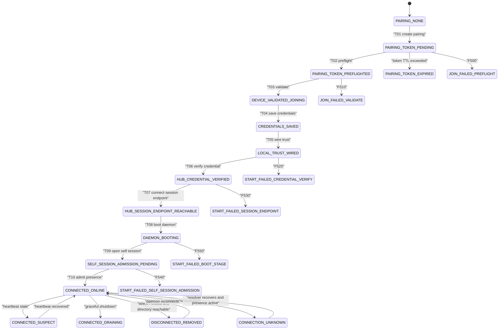
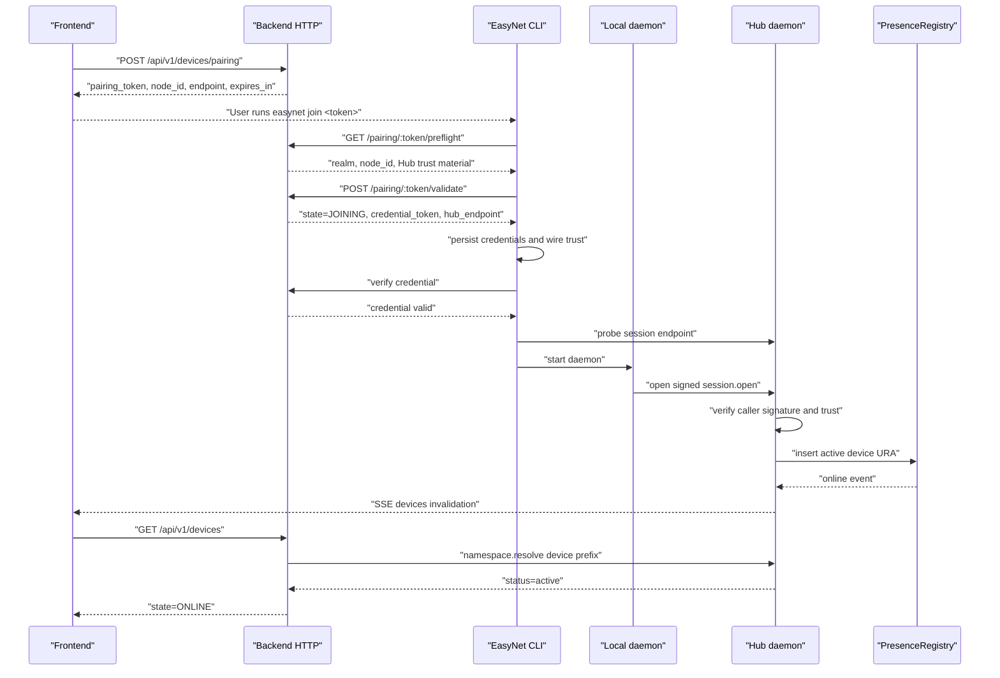

# EasyNet Join-to-Connected State Machine

Date: 2026-06-08

Scope: user gets a frontend pairing token, runs `easynet join`, the local daemon starts, the Hub admits the device, and the frontend eventually renders the device as connected.

## Executive Verdict

Current implementation now has a concrete CLI-owned product state machine for the local join-to-connected path. Backend and frontend have compatible DTO/rendering semantics for degraded device state; terminal receipt failures now carry typed failure locators for terminal states instead of relying only on free-form receipt reasons.

Implementation update from this pass:

- EasyNet-Cli now owns a `JoinConnectionSnapshot` value object and persists the latest snapshot to `~/.easynet/connection-state.json`.
- `easynet doctor --json`, human `easynet doctor`, `easynet runtime status --json`, and human `easynet runtime status` now surface the same connection state tuple.
- `easynet docker status --json` and `easynet docker doctor` are first-class operator facades over the same state machine.
- Device-mode `join` and `runtime start` record preflight, validate, credential save, trust wiring, credential verification, session endpoint, daemon boot, admission success, and structured failure snapshots.
- CLI failure snapshots keep `state_code` as the stable product bucket and put the most specific runtime reason into `failure.code` when the reason is provable, for example `F540` plus `CALLER_SIGNATURE_INVALID`.
- Terminal bidi receipt producers now write `InvocationReceipt.failure` for failed/timed-out/cancelled terminal receipts. A shared runtime classifier extracts RFC-shaped causes such as `AXON_*`, `CALLER_*`, `AUTHORITY_*`, `TARGET_NOT_IN_PRESENCE_REGISTRY`, and `AGENT_NOT_ADVERTISED`.
- The Docker/operator command path is covered by a binary-level integration test: a persisted `F540 / T09_OPEN_SELF_SESSION / CALLER_SIGNATURE_INVALID` snapshot must be visible through `easynet docker status --json`.
- Frontend state rendering now treats `UNKNOWN` as a first-class degraded state and no longer counts `JOINING` as online liveness.

What exists now:

- Backend pairing and device APIs expose string states such as `JOINING`, `ONLINE`, `SUSPECT`, `DRAINING`, `REMOVED`, and `UNKNOWN`.
- Axon proto already has numeric node states for part of the runtime plane: `JOINING=1`, `PROBATION=2`, `HEALTHY=3`, `SUSPECT=4`, `QUARANTINED=5`, `DRAINING=6`, `REMOVED=7`.
- CLI runtime boot has staged boot events and now fails closed if Hub credential verification or initial `session.open` admission fails.
- Hub-side `PresenceRegistry` is the real liveness owner. A device is connected only when its device URA is present and active in that registry.
- Backend HTTP read models now carry `resolve_unavailable` for resolver/runtime failures in the device, session, ability, agent, page, skill, and call listing surfaces instead of silently returning empty results or plain 500s.

What still needs deeper follow-up:

- Backend/frontend should continue converging their non-device DTOs onto the same state snapshot shape when new product surfaces expose connection-state semantics.
- RFC-005 should keep adding finer failure-code taxonomy; the current implementation preserves known admission/runtime causes and falls back to stable product buckets when the runtime cannot prove a finer code.
- Full container e2e should repeat the same persisted-snapshot assertion through `easynet docker status --json` inside a real compose deployment.

The target invariant is now enforced at the CLI/operator boundary: every visible local join/start state has a stable code; every recorded failure names the interrupted transition, precise failure code when available, source, retryability, and operator-facing reason.

## Current Ownership Boundaries

| Layer | Responsibility | Must not own |
| --- | --- | --- |
| Frontend | Create pairing token, show CLI command, subscribe to SSE invalidation, render backend read model | Device liveness truth |
| Backend HTTP | Pairing lifecycle, user ownership, credential issuance, read model projection, resolver failure DTOs | Axon runtime implementation, daemon session admission |
| EasyNet-Cli facade | `join`, `start`, `doctor`, operator output, local credential/trust persistence | Backend read model policy |
| CLI daemon / Axon runtime | `session.open`, ability routing, local abilities, PresenceRegistry, namespace resolve product call surface | Frontend pairing UX |
| Hub PresenceRegistry | Current online/offline membership | Long-term user pairing ownership |

## Current Data Flow

1. Frontend calls `POST /api/v1/devices/pairing` with the user's JWT.
2. Backend creates a pending pairing token, stores only the token hash, reserves a node ID, and returns the plaintext token once.
3. Frontend displays the token and CLI command.
4. User runs `easynet join <token>`.
5. CLI calls pairing preflight, receives reserved node ID and Hub trust material.
6. CLI generates or derives the device signing key for that realm and node ID.
7. CLI calls pairing validate with device metadata and device public key.
8. Backend atomically changes pairing status from `pending` to `validated`, registers the device public key best-effort with the local Hub daemon, and returns `JOINING` plus a plaintext credential token.
9. CLI saves credentials, config, keyring, federation peer trust, and realm trust.
10. CLI starts the local daemon unless `--boot no`.
11. CLI start verifies the credential with backend `/verify-credential`.
12. CLI start verifies the Hub session endpoint is reachable with a plain socket preflight. This step must not load the dendrite bridge.
13. Daemon boots invocation transport, loads the bridge/runtime implementation as needed, and opens `session.open` to the Hub.
14. Hub admission validates the caller signature and inserts the device URA into `PresenceRegistry`.
15. Hub directory/SSE broker emits an invalidation event.
16. Frontend invalidates React Query caches and refetches `/api/v1/devices`.
17. Backend calls `namespace.resolve`, sees active presence, and returns `state=ONLINE`.

The important product invariant: `/validate` means "credential issued"; it does not mean "connected".

## Current Wire Structures

### Create Pairing Response

```json
{
  "pairing_token": "plaintext-token-visible-once",
  "realm": "localhost",
  "endpoint": "http://127.0.0.1:8080",
  "node_id": "reserved-node-id",
  "expires_in": 300
}
```

### Pairing Preflight Response

```json
{
  "realm": "localhost",
  "node_id": "reserved-node-id",
  "hub_public_key_b64": "base64",
  "hub_tls_ca_pem_b64": "base64",
  "hub_agent_ura": "easynet:///r/localhost/hub"
}
```

### Pairing Validate Request

```json
{
  "node_id": "reserved-node-id",
  "display_name": "MacBook Pro",
  "os": "macos",
  "arch": "arm64",
  "hostname": "host",
  "device_public_key": "ed25519-public-key-hex"
}
```

### Pairing Validate Response

```json
{
  "node_id": "reserved-node-id",
  "state": "JOINING",
  "credential_provisioned": true,
  "credential_token": "plaintext-credential-visible-once",
  "hub_endpoint": "https://127.0.0.1:50443",
  "realm": "localhost",
  "username": "user",
  "deploy_signature": "...",
  "ura": "easynet:///r/localhost/device/reserved-node-id"
}
```

### CLI Credentials

```json
{
  "node_id": "reserved-node-id",
  "credential_token": "plaintext-credential",
  "hub_endpoint": "https://127.0.0.1:50443",
  "realm": "localhost",
  "deploy_signature": "...",
  "hub_api_base": "http://127.0.0.1:8080",
  "username": "user",
  "hub_pubkey_b64": "base64",
  "hub_tls_ca_pem_b64": "base64"
}
```

### Backend Device Read Model

```json
{
  "node_id": "reserved-node-id",
  "state": "ONLINE",
  "credential_provisioned": true,
  "public_key_registered": true,
  "hub_endpoint": "https://127.0.0.1:50443",
  "realm": "localhost",
  "ura": "easynet:///r/localhost/device/reserved-node-id",
  "last_seen_unix_ms": 1780887351381,
  "resolve_unavailable": []
}
```

### Resolver Failure DTO

```json
{
  "source": "namespace.resolve",
  "reason": "RESOLVE_UNAVAILABLE",
  "query_name": "easynet:///r/localhost/device/reserved-node-id",
  "message": "agent is not advertised on this hub",
  "code": "UNAVAILABLE",
  "stage": "resolve",
  "retryable": true,
  "retry_after_unix_ms": 1780887355000
}
```

### Call List Degraded DTO

`/api/v1/calls` remains renderable during Axon/daemon outages, but it no longer claims a healthy empty call list. The read model now carries the interrupted runtime source:

```json
{
  "items": [],
  "resolve_unavailable": [
    {
      "source": "voice.list_calls",
      "reason": "UNSPECIFIED",
      "message": "daemon grpc unavailable",
      "code": "TARGET_NOT_IN_PRESENCE_REGISTRY",
      "stage": "admission",
      "retryable": true
    }
  ]
}
```

### SSE Invalidation Event

```json
{
  "channel": "devices",
  "node_id": "reserved-node-id",
  "kind": "state_changed"
}
```

SSE does not carry authoritative device state. It only invalidates frontend cache; the frontend must refetch the backend read model.

## State Code Contract

The following table is the missing product contract. These codes should be added to DTOs and CLI/docker status surfaces. String names are for humans; codes are for stable product logic, logs, tests, and support.

| Code | State | Owner | Meaning | Terminal |
| --- | --- | --- | --- | --- |
| P000 | `PAIRING_NONE` | Frontend/backend | No active pairing token exists for this user action | No |
| P100 | `PAIRING_TOKEN_PENDING` | Backend | Token was created, hash stored, TTL active | No |
| P110 | `PAIRING_TOKEN_PREFLIGHTED` | Backend/CLI | CLI proved it has the token and received reserved node/trust material | No |
| P120 | `PAIRING_TOKEN_EXPIRED` | Backend | Pending token expired before validate | Yes |
| P130 | `PAIRING_TOKEN_CONSUMED` | Backend | Token already moved out of pending | Yes |
| J200 | `DEVICE_VALIDATED_JOINING` | Backend | Credential was issued and DB pairing is `validated`; runtime liveness not proven | No |
| J210 | `CREDENTIALS_SAVED` | CLI | Credential/config material persisted locally | No |
| J220 | `LOCAL_TRUST_WIRED` | CLI | keyring, realm trust, and federation peer wiring completed | No |
| S300 | `RUNTIME_STARTING` | CLI | CLI is starting the local daemon | No |
| S310 | `HUB_CREDENTIAL_VERIFIED` | CLI/backend | Backend accepted the stored credential token | No |
| S320 | `HUB_SESSION_ENDPOINT_REACHABLE` | CLI | Hub session endpoint accepted TCP/TLS connection | No |
| S330 | `DAEMON_BOOTING` | CLI daemon | Daemon boot stages are running | No |
| S340 | `SELF_SESSION_ADMISSION_PENDING` | CLI daemon/Hub | Daemon opened `session.open`; Hub admission not yet proven | No |
| C400 | `CONNECTED_ONLINE` | Hub/backend/frontend | PresenceRegistry has active device URA and backend projected `ONLINE` | No |
| C410 | `CONNECTED_SUSPECT` | Hub/backend/frontend | Directory reports stale heartbeat | No |
| C420 | `CONNECTED_DRAINING` | Hub/backend/frontend | Directory reports graceful drain | No |
| C430 | `DISCONNECTED_REMOVED` | Backend/frontend | Directory is reachable but the device URA is absent/removed | No |
| C440 | `CONNECTION_UNKNOWN` | Backend/frontend | Directory or resolver is unavailable, so absence cannot be trusted | No |
| F500 | `JOIN_FAILED_PREFLIGHT` | CLI/backend | Token missing, expired, malformed, or rejected during preflight | Yes |
| F510 | `JOIN_FAILED_VALIDATE` | CLI/backend | Validate failed or node/trust envelope mismatched | Yes |
| F520 | `START_FAILED_CREDENTIAL_VERIFY` | CLI/backend | Backend credential verification failed or was unavailable | Yes |
| F530 | `START_FAILED_SESSION_ENDPOINT` | CLI | Hub session endpoint could not be reached | Yes |
| F540 | `START_FAILED_SELF_SESSION_ADMISSION` | CLI daemon/Hub | Hub rejected initial `session.open`, for example `CALLER_SIGNATURE_INVALID` | Yes |
| F550 | `START_FAILED_BOOT_STAGE` | CLI daemon | A daemon boot stage failed before ready; `failure.code` carries the concrete local cause such as `DENDRITE_BRIDGE_LIBRARY_NOT_FOUND` | Yes |
| F560 | `RESOLVE_UNAVAILABLE` | Backend/frontend | Runtime may be fine, but read model could not resolve namespace/directory state | No |

## Transition Contract

| Transition | From | To | Actor | Input | Failure Code |
| --- | --- | --- | --- | --- | --- |
| T01_CREATE_PAIRING | P000 | P100 | Frontend/backend | JWT user identity | F500 |
| T02_PREFLIGHT_TOKEN | P100 | P110 | CLI/backend | plaintext pairing token | F500 |
| T03_VALIDATE_TOKEN | P110 | J200 | CLI/backend | device public key and metadata | F510 |
| T04_SAVE_CREDENTIALS | J200 | J210 | CLI | validate response | F510 |
| T05_WIRE_LOCAL_TRUST | J210 | J220 | CLI | Hub trust material, realm, node ID | F510 |
| T06_VERIFY_CREDENTIAL | J220 | S310 | CLI/backend | saved credential token | F520 |
| T07_CONNECT_SESSION_ENDPOINT | S310 | S320 | CLI | Hub session endpoint TCP socket reachability only | F530 |
| T08_BOOT_DAEMON | S320 | S330 | CLI daemon | local config, keyring, bridge/runtime dependencies | F550 |
| T09_OPEN_SELF_SESSION | S330 | S340 | CLI daemon/Hub | signed `session.open` bidi | F540 |
| T10_ADMIT_PRESENCE | S340 | C400 | Hub | valid caller signature and trust anchor | F540 |
| T11_REFETCH_READ_MODEL | C400/C410/C420/C430/C440 | same projection | Frontend/backend | SSE invalidation or polling | F560 |
| T12_REMOVE_PRESENCE | C400 | C430/C440 | Hub/backend | stream close, reset, send failure, admin revoke | F560 |

Your observed log:

```text
CALLER_SIGNATURE_INVALID
target device is not in PresenceRegistry
frontend shows REMOVED or pages return generic 500
```

maps to:

```text
state_code = F540
state = START_FAILED_SELF_SESSION_ADMISSION
interrupted_transition = T09_OPEN_SELF_SESSION
failure_code = CALLER_SIGNATURE_INVALID
```

If `namespace.resolve` itself is down, that is not `REMOVED`; it is:

```text
state_code = F560
state = RESOLVE_UNAVAILABLE
interrupted_transition = T11_REFETCH_READ_MODEL
```

If the Hub socket is reachable but the local native bridge is missing, that is not `F530`. It is a local daemon/runtime dependency failure:

```text
state_code = F550
state = START_FAILED_BOOT_STAGE
interrupted_transition = T08_BOOT_DAEMON
failure_code = DENDRITE_BRIDGE_LIBRARY_NOT_FOUND
```

## State Transition Diagram



## Sequence Diagram



## OOP Design That Should Exist

The current code has useful local objects, but not the right end-to-end object model.

Good current objects:

- `PresenceRegistry`: owns online/offline membership and emits presence changes.
- SSE broker: converts directory changes into frontend invalidation events.
- CLI boot watcher/stage renderer: renders boot progress and failure.
- Backend resolver adapters: normalize typed `ResolveAnswer` and `ResolveUnavailable`.

Missing product object:

```rust
#[derive(Clone, Debug, Serialize, Deserialize)]
pub struct JoinConnectionSnapshot {
    pub state: JoinConnectionState,
    pub state_code: &'static str,
    pub transition: Option<JoinTransition>,
    pub interrupted_transition: Option<JoinTransition>,
    pub failure: Option<JoinConnectionFailure>,
    pub realm: String,
    pub node_id: String,
    pub device_ura: String,
    pub hub_endpoint: Option<String>,
    pub source: JoinStateSource,
    pub observed_at_unix_ms: i64,
}

#[derive(Clone, Copy, Debug, Serialize, Deserialize)]
pub enum JoinConnectionState {
    PairingNone,
    PairingTokenPending,
    PairingTokenPreflighted,
    DeviceValidatedJoining,
    CredentialsSaved,
    LocalTrustWired,
    RuntimeStarting,
    HubCredentialVerified,
    HubSessionEndpointReachable,
    DaemonBooting,
    SelfSessionAdmissionPending,
    ConnectedOnline,
    ConnectedSuspect,
    ConnectedDraining,
    DisconnectedRemoved,
    ConnectionUnknown,
    Failed(JoinFailureCode),
}

#[derive(Clone, Copy, Debug, Serialize, Deserialize)]
pub enum JoinTransition {
    CreatePairing,
    PreflightToken,
    ValidateToken,
    SaveCredentials,
    WireLocalTrust,
    VerifyCredential,
    ConnectSessionEndpoint,
    BootDaemon,
    OpenSelfSession,
    AdmitPresence,
    RefetchReadModel,
    RemovePresence,
}

#[derive(Clone, Debug, Serialize, Deserialize)]
pub struct JoinConnectionFailure {
    pub failure_code: String,
    pub message: String,
    pub retryable: bool,
    pub stage: String,
    pub interrupted_transition: JoinTransition,
}

pub trait JoinStateObserver {
    fn snapshot(&self) -> anyhow::Result<JoinConnectionSnapshot>;
}
```

Backend Go DTO should mirror the same contract:

```go
type DeviceConnectionState struct {
	State                 string             `json:"state"`
	StateCode             string             `json:"state_code"`
	TransitionID          string             `json:"transition_id,omitempty"`
	InterruptedTransition string             `json:"interrupted_transition,omitempty"`
	Failure               *ConnectionFailure `json:"failure,omitempty"`
	ObservedAtUnixMS      int64              `json:"observed_at_unix_ms"`
}

type ConnectionFailure struct {
	Code      string `json:"code"`
	Message   string `json:"message"`
	Stage     string `json:"stage"`
	Retryable bool   `json:"retryable"`
}
```

Frontend should treat this as a typed value object, not as free-form text:

```ts
export interface DeviceConnectionState {
  state: string;
  state_code: string;
  transition_id?: string;
  interrupted_transition?: string;
  failure?: {
    code: string;
    message: string;
    stage: string;
    retryable: boolean;
  };
  observed_at_unix_ms: number;
}
```

## CLI, Doctor, and Docker Status Contract

Current `easynet doctor` still reports broad checks: pairing, local runtime, federation, agents, and MCP clients. It now also answers the support question precisely through the persisted connection snapshot:

```text
Which state code am I in?
Which transition failed?
What exact failure code did Hub/backend/daemon return?
Is the failure retryable?
```

The target human output should be:

```text
EasyNet connection
  state: START_FAILED_SELF_SESSION_ADMISSION [F540]
  transition: T09_OPEN_SELF_SESSION
  node: c130295e-9682-499e-bc09-72d4678a5887
  device_ura: easynet:///r/localhost/device/c130295e-9682-499e-bc09-72d4678a5887
  hub_endpoint: https://127.0.0.1:50443
  reason: CALLER_SIGNATURE_INVALID
  retryable: false
  next: re-pair or fix Hub trust/device public key registration
```

The target JSON output should be:

```json
{
  "state": "START_FAILED_SELF_SESSION_ADMISSION",
  "state_code": "F540",
  "transition_id": "T09_OPEN_SELF_SESSION",
  "interrupted_transition": "T09_OPEN_SELF_SESSION",
  "failure": {
    "code": "CALLER_SIGNATURE_INVALID",
    "message": "Hub rejected session.open during initial admission",
    "stage": "self_session_admission",
    "retryable": false
  },
  "realm": "localhost",
  "node_id": "c130295e-9682-499e-bc09-72d4678a5887",
  "device_ura": "easynet:///r/localhost/device/c130295e-9682-499e-bc09-72d4678a5887",
  "hub_endpoint": "https://127.0.0.1:50443",
  "observed_at_unix_ms": 1780887351381
}
```

If the product keeps the name `easynet docker`, then it should be a thin operator facade over the same snapshot:

```text
easynet docker status --json
easynet docker doctor
```

It must not invent a separate Docker-only state model. Docker is an execution environment; the product state machine is the same.

## Are the `easynet join` Stage Events Real?

Short answer: yes, but they are not all the same class of fact.

The `easynet join <token> --hub <backend>` output is a live stage renderer. A green check means the function backing that stage returned success. It does not automatically mean "the device is connected to Hub PresenceRegistry" unless the stage is part of daemon start and the daemon has passed the initial `session.open` admission gate.

| Stage shown by CLI | Source of truth | What it proves | What it does not prove |
| --- | --- | --- | --- |
| `preflight` | Backend pairing preflight HTTP response | Token exists and backend returned reserved `realm`, `node_id`, and hub trust material | Device is not paired or connected yet |
| `validate-token` | Backend pairing validate HTTP response | Backend accepted the one-shot token, device public key, and metadata; credential token issued | Hub PresenceRegistry has not admitted this daemon yet |
| `save-credentials` | Local filesystem write | `~/.easynet/credentials.json` was persisted | Credential may still fail runtime verification later if revoked |
| `daemon-config` | Local daemon config writer | Device-mode daemon config exists and points at the paired hub endpoint | Hub socket or admission is not proven |
| `federated-peers` | Local `daemon-config.toml` edit | Cross-hub peer map was wired, or the stage is now explicitly rendered as skipped with a reason | It is not device liveness |
| `keyring` | Local keyring RPC or deterministic fallback | Device signing material is available to runtime | Hub has not verified the signature yet |
| `realm-trust` | Local `realm-trust.toml` edit | Device and hub trust entries were written; latest implementation requires hub trust material instead of silently marking partial trust as complete | It is still local file state until daemon reads it |
| `refresh-runtime` | Local runtime refresh attempt | Existing runtime was asked to republish, or no running runtime needed refresh | It is best-effort and not the final connection proof |
| `kernel` through `pages-listener` | Daemon `BootBus` events | The daemon actually emitted boot-stage events from `easynet-daemon` | Only `daemon-invocation-transport` gates initial self-session admission |
| `daemon-invocation-transport` | Daemon invocation transport boot | In device mode, this does not return success until the first `session.open` admission probe succeeds or fails closed | It does not prove frontend cache has already refetched |
| `daemon ready` | Daemon terminal `BootEvent::Ready` | Local daemon completed all boot stages after invocation transport admission gate | Frontend may still need SSE/polling to render `ONLINE` |
| `Join complete` | CLI summary after `runtime start` returns `Ok` | Pairing and local daemon startup completed | Backend read model still needs to project live state |

This means the output you pasted is not fake. The important correction is semantic: `validate-token` and `Pairing accepted` mean `J200 DEVICE_VALIDATED_JOINING`, not `C400 CONNECTED_ONLINE`. The first point at which CLI can honestly report local connected state is after `daemon-invocation-transport` succeeds in device mode and the daemon emits `Ready`.

The latest CLI change also closes the misleading part of the old output: local wiring stages no longer get an unconditional checkmark when their helper could not complete. They render as skipped with a concrete reason. `easynet doctor` now promotes failed connection snapshots such as `F540 / T09_OPEN_SELF_SESSION / CALLER_SIGNATURE_INVALID` to a real failed check, and `easynet docker status --json` exposes the same snapshot for CI/container operators.

## Frontend Rendering Rules

Frontend should render from typed state, not infer connection truth from the presence of a DB row.

| State Code | UI Label | UI Treatment |
| --- | --- | --- |
| J200 | Joining | Credential accepted; waiting for local daemon admission |
| S300-S340 | Connecting | Runtime boot/admission in progress |
| C400 | Online | Device is connected and routable |
| C410 | Suspect | Device heartbeat stale; actions may fail |
| C420 | Draining | Device is shutting down; no new work should be sent |
| C430 | Offline | Directory is reachable and device is absent |
| C440 | Unknown | Directory unavailable; do not claim offline |
| F500-F550 | Failed | Show failure code, transition, and next action |
| F560 | Partial outage | Show resolver issue without deleting device context |

Product rule: `REMOVED` must only mean "directory was reachable and the device is absent or removed." Resolver failure must render as `UNKNOWN` or `RESOLVE_UNAVAILABLE`.

## Business Logic Rules

1. Pairing token plaintext is returned only once. Backend stores only the token hash.
2. Pairing token expiration is a backend state transition, not a CLI guess.
3. `validate` is an ownership and credential transition, not a liveness transition.
4. The backend must never promote a device to `ONLINE` from the database alone.
5. The only source of `ONLINE` is active Hub presence through `namespace.resolve`.
6. SSE events are cache invalidations, not state authority.
7. If `namespace.resolve` fails, backend returns `resolve_unavailable`; frontend renders degraded state.
8. If directory is available and a validated device is absent, backend may render `REMOVED`.
9. CLI daemon startup must be fail-closed for device mode: do not report ready until initial `session.open` admission succeeds.
10. `CALLER_SIGNATURE_INVALID` is a hard admission failure at `T09_OPEN_SELF_SESSION`, not a frontend polling issue.
11. Non-device runtime list surfaces such as `voice.list_calls` must distinguish "empty successful list" from "runtime query unavailable" through `resolve_unavailable`.
12. Dendrite bridge loading is daemon/runtime boot work, not the Hub reachability oracle for `T07_CONNECT_SESSION_ENDPOINT`.

## Implementation Gaps Remaining

1. Add real compose-level e2e for `easynet docker status --json` covering `F540 / T09_OPEN_SELF_SESSION`; current coverage pins the built binary and persisted snapshot contract.
2. Extend backend/frontend tests once the device DTO generator is regenerated from the API schema instead of hand-maintained generated files.
3. Continue RFC-005 taxonomy work so future terminal receipt producers can emit narrower codes beyond the currently extracted admission/runtime causes.
4. Continue auditing newly added HTTP/frontend listing surfaces after this branch so new resolver/hub failure paths cannot reintroduce healthy empty lists or generic 5xx.
5. Full end-to-end join output snapshot tests should cover the human renderer itself; unit coverage now pins the lower-level missing hub trust material error.

## Clean Target

The clean implementation should have one product state machine, not three partial interpretations.

- Backend owns pairing persistence and read model projection.
- CLI owns local startup and operator status.
- Hub owns live presence.
- Frontend owns display and invalidation.
- The shared contract is `JoinConnectionSnapshot`.

When a user says "why is my device not connected?", every surface should answer with the same tuple:

```text
state_code + state + transition_id + failure_code + reason + retryable + next_action
```
