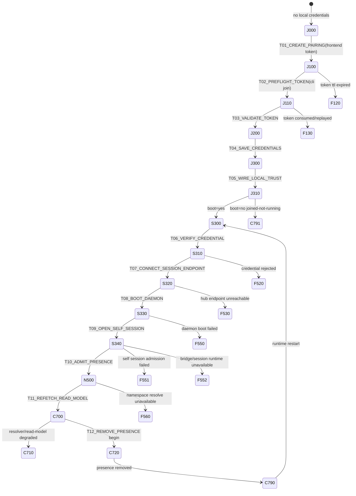
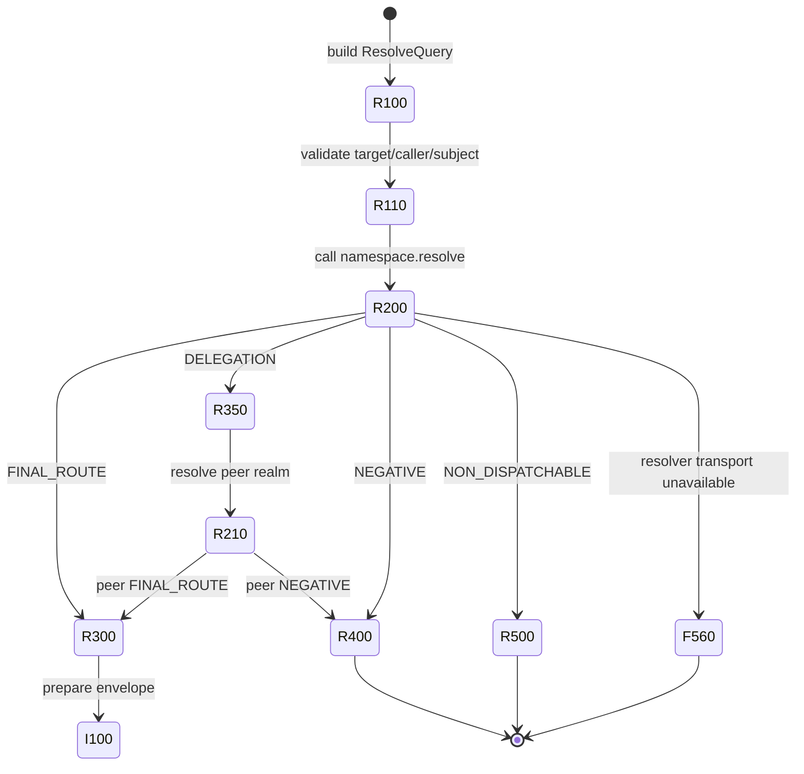
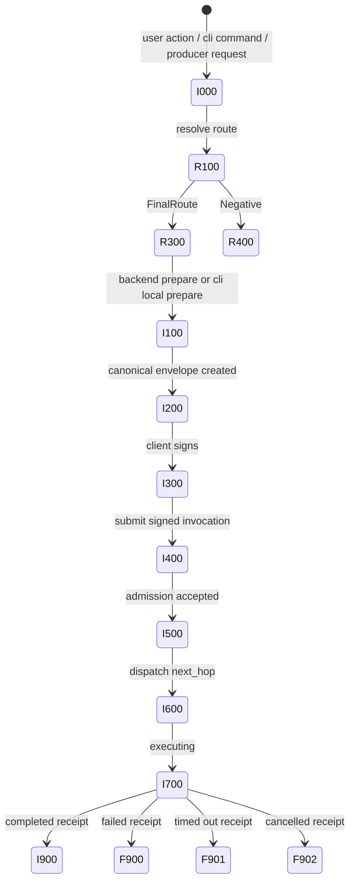
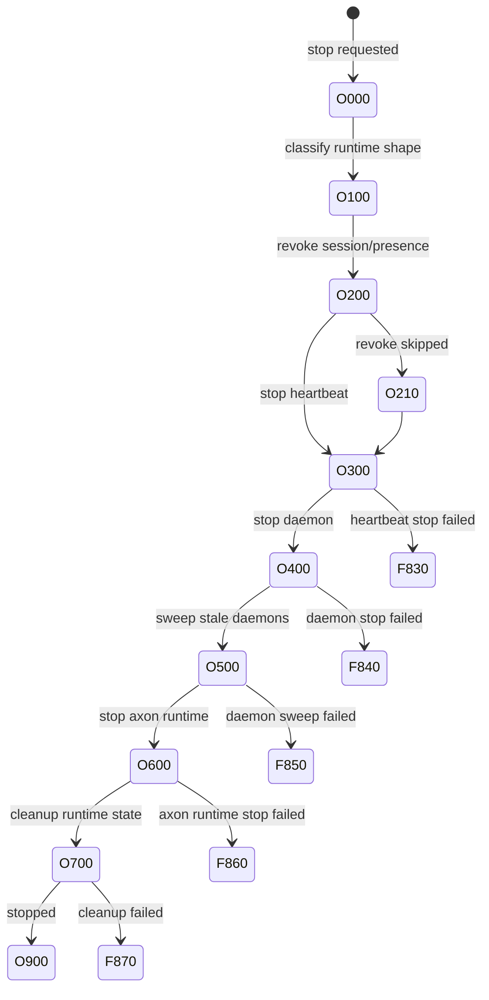
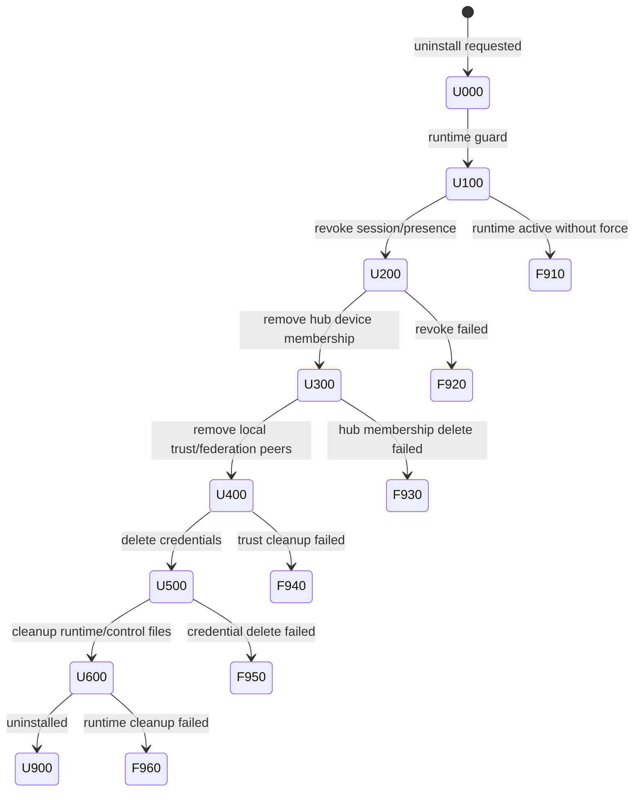

# EasyNet 状态机器现实审计与修正版

日期: 2026-06-09  
状态: current-code audit + corrected target contract  
适用仓库: EasyNet-Cli, EasyNet-Axon, EasyNet Backend, EasyNet Frontend, EasyNet-Client  
目的: 把当前代码已经实现的事实、RFC-005 的目标契约、仍未收敛的缺口分开写清楚。本文替代早期只写 clean target 的理想化状态机草稿。

## 0. 更正结论

前一版文档的问题是: 把目标架构、当前代码和缺口混在一起了。它没有足够明确地回答三个问题:

1. 当前代码到底在哪些文件里已经实现了哪些状态。
2. 哪些状态码是现有事实, 哪些只是目标设计。
3. 哪些路径仍然在靠字符串、空列表、普通 400/500 或客户端拼 URA 运行。

本文的规则是: 每个状态机都必须同时给出 `Current implementation`, `Target contract`, `Gap`。没有源文件证据的状态不能写成已实现。

核心判断:

- `JoinConnectionState` 已经存在, 但状态码不是一一对应, 多个状态被压成同一 code, 不足以定位具体中断状态。
- `runtime start` 已经在 credential verify、Hub session endpoint、daemon boot failure 上记录 snapshot, 并且 join autostart 失败时会显式报错。这一点是当前正确实现。
- `runtime stop` 当前是 `StopPlan/StopStage` 命令阶段对象, 不是持久化产品状态机; `doctor --json` 不能稳定报告停在哪个 stop transition。
- `reset` 当前是本地 unpair/reset, 不是完整 self uninstall/leave; revoke 是 best-effort, 失败后仍继续本地 reset。
- Backend invoke prepare/submit 已经基本切到 resolver-selected route, 但 page/read-model/media/download/history 等路径仍有未收敛点。
- Axon 的 resolver negative reason 只有 RFC-005/proto 定义的固定集合; 不能把 `agent not advertised`、`PresenceRegistry miss` 当作新的 Axon NegativeReason。它们应映射成 canonical failure code + failure locator detail。

## 1. 建模规则

状态机不能混用生命周期。EasyNet 至少有八个独立但相互引用的状态机:

| State machine | Owner | 当前是否完整 | 说明 |
| --- | --- | --- | --- |
| Join credential/runtime admission | CLI | 部分完整 | `JoinConnectionState` 已存在, 但 code 粒度不足 |
| Runtime start/session/presence | CLI daemon + Hub | 部分完整 | start 记录 snapshot, 但 admission evidence 仍需更强约束 |
| Namespace resolve | Axon + CLI daemon | 协议完整, 产品接入未全收敛 | `ResolveAnswerKind`/NegativeReason 已有规范 |
| Invocation prepare/submit/dispatch/receipt | Axon + Backend + CLI daemon + Frontend | 部分完整 | prepare/submit 已迁移, producer failure receipt 尚未全覆盖 |
| Backend HTTP read model | Backend | 部分完整 | pages 已有 unavailable DTO, 仍有字符串解析和普通 500 |
| Frontend UI connected/degraded | Frontend | 部分完整 | invoke DTO route-aware, media path 仍解析字符串 |
| Runtime stop | CLI | 命令阶段存在, 产品状态机缺失 | 需要 `StopConnectionSnapshot` 或统一 `RuntimeLifecycleSnapshot` |
| Reset / self uninstall / leave | CLI + Backend/Hub | 缺失 | 当前 reset 不等于 self uninstall |

状态表每一行必须包含:

- owner: 状态由哪个仓库/模块决定。
- current source: 当前实现文件和对象。
- entry event: 什么事件进入该状态。
- transition id: 稳定 transition 标识。
- code: 对外稳定状态码。
- observable surface: CLI、doctor、Backend DTO、Frontend UI、receipt、log 中怎么观察。
- terminal: 是否终止本次 attempt。
- gap: 当前是否只是目标状态。

## 2. 当前代码审计

| Area | Current source | Current fact | Gap |
| --- | --- | --- | --- |
| Join snapshot | `EasyNet-Cli/src/runtime/join_connection_state.rs` | 定义 `JoinConnectionState`, `JoinTransition`, `JoinFailureCode`, `JoinConnectionSnapshot`, 持久化到 `~/.easynet/connection-state.json` | code 不是一一对应: `PairingTokenPending/Preflighted/Consumed` 都是 `J100`; `CredentialsSaved/LocalTrustWired/HubCredentialVerified/HubSessionEndpointReachable` 都是 `J300`; boot/admission failure 也有合并 |
| Join autostart | `EasyNet-Cli/src/facade/cli/join.rs` | pairing accepted 后默认调用 `runtime start`; start 失败时报 `pairing credentials were saved, but daemon startup failed` | 文案已经正确, 但 failure code 粒度仍不足 |
| Runtime start | `EasyNet-Cli/src/facade/cli/start.rs` | credential verify、Hub session endpoint probe、daemon boot failure 都记录 snapshot | `ConnectedOnline` 需要确保只在 `session.open` admission / PresenceRegistry evidence 成立后记录 |
| Stop | `EasyNet-Cli/src/facade/cli/stop.rs` | `StopPlan` 分阶段执行 revoke、heartbeat、daemon、sweep、axon runtime、cleanup | 不是持久化状态机; doctor 无法报告 stop code/transition |
| Reset | `EasyNet-Cli/src/facade/cli/reset.rs` | active runtime 时拒绝 reset; daemon alive 时 best-effort revoke; 然后删除本地 credentials | 不是 self uninstall; revoke 失败仍继续 local reset, 需要明确状态和风险 |
| Backend route facade | `EasyNet/backend/internal/logic/ability/resolve_invoke_route.go` | 使用 daemon `ResolveInvokeRoute`; negative answer 转 typed validation error | 基本方向正确 |
| Backend prepare | `EasyNet/backend/internal/logic/ability/prepareEnvelopeLogic.go` | request 使用 `target_ura/tool_name`; response 绑定 selected ability/route/dispatch | 基本方向正确 |
| Backend submit | `EasyNet/backend/internal/logic/ability/submitSignedInvocationLogic.go` | submit 不重新 resolve, 验证 prepare-time route binding | 基本方向正确 |
| Backend pages | `EasyNet/backend/internal/logic/page/listPagesLogic.go`, `helpers.go` | pages agent offline 可返回 unavailable DTO | 仍通过错误字符串判断 `PresenceRegistry`/`not advertised`; 其他路径仍可能普通 500 |
| Frontend invoke DTO | `EasyNet/Frontend/src/lib/api/easynet-abilities.ts` | `InvokeAbilityReq` 使用 `target_ura/tool_name`, failure locator 类型存在 | 基本方向正确 |
| Frontend media | `EasyNet/Frontend/src/store/media-channel-*.ts` | remote desktop 路径仍查找 `PresenceRegistry` 字符串 | 应改为 typed failure locator/code |
| macOS client | `EasyNet-Client/macos/EasyNetAgent/App/DeviceConnectionManager.swift` | 仍可能在缺 `ability_ura` 时合成 ability URA | 应删除客户端 canonical URA synthesis |
| Axon namespace proto | `EasyNet-Axon/core/proto/axon/v1/namespace.proto` | `ResolveAnswerKind`, `NegativeReason`, `NextHop` 已规范 | 产品层必须按 proto 映射, 不能扩展人类字符串 reason |
| Axon receipt proto | `EasyNet-Axon/core/proto/axon/v1/invoke.proto` | `InvocationReceipt.failure` 已存在 | terminal/resource/download producer 需要统一写入 |

## 3. Join / Runtime Start 状态机

### 3.1 当前实现状态

当前 CLI 的事实状态来自 `JoinConnectionState`:

| Current state | Current code | Wire state | 当前语义 | 主要问题 |
| --- | --- | --- | --- | --- |
| `PairingNone` | `J000` | `PAIRING_NONE` | 本地无 pairing | OK |
| `PairingTokenPending` | `J100` | `AUTH_TOKEN_READY` | token 已创建/待使用 | 与 preflight/consumed 混码 |
| `PairingTokenPreflighted` | `J100` | `AUTH_TOKEN_READY` | CLI 已 preflight token | 与 pending 混码 |
| `PairingTokenExpired` | `F510` | `JOIN_REJECTED` | token 过期 | OK |
| `PairingTokenConsumed` | `J100` | `JOIN_REQUESTED` | token 已消费/正在 join | 不应与 pending 混码 |
| `DeviceValidatedJoining` | `J200` | `PAIRING_ACCEPTED` | Backend 已验证 device 并发 credential | OK |
| `CredentialsSaved` | `J300` | `HUB_PREFLIGHT` | 本地 credential 已保存 | 与 trust/preflight 混码 |
| `LocalTrustWired` | `J300` | `HUB_PREFLIGHT` | local realm trust/federation peers 已写入 | 与 credential 混码 |
| `RuntimeStarting` | `J400` | `DAEMON_BOOT` | runtime start 进入 boot | 与 daemon booting 混码 |
| `HubCredentialVerified` | `J300` | `HUB_PREFLIGHT` | Backend credential verify 通过 | 与本地保存混码 |
| `HubSessionEndpointReachable` | `J300` | `HUB_PREFLIGHT` | Hub session endpoint 可达 | 与 credential 混码 |
| `DaemonBooting` | `J400` | `DAEMON_BOOT` | daemon process booting | 与 runtime starting 混码 |
| `SelfSessionAdmissionPending` | `J500` | `SESSION_CONNECTING` | `session.open` admission pending | OK |
| `ConnectedOnline` | `J800` | `FRONTEND_CONNECTED` | 设备在线 | 与 suspect/draining 混码 |
| `ConnectedSuspect` | `J800` | `DEGRADED` | 连接可疑/降级 | 不应与 online 混码 |
| `ConnectedDraining` | `J800` | `OFFLINE` | 正在下线 | 不应与 online 混码 |
| `DisconnectedRemoved` | `F530` | `OFFLINE` | 已从 presence/read model 移除 | 与 unknown 混码 |
| `ConnectionUnknown` | `F530` | `OFFLINE` | 未知连接状态 | 与 removed 混码 |
| `Failed` | `F000` | `FAILED` | 未分类失败 | 需要减少使用 |

### 3.2 目标状态码修正

干净实现不需要兼容旧 code。目标应把状态码调整为一一对应:

| Target code | Target state | Transition in | Observable surface |
| --- | --- | --- | --- |
| `J000` | `PAIRING_NONE` | none | doctor/runtime status |
| `J100` | `PAIRING_TOKEN_PENDING` | `T01_CREATE_PAIRING` | frontend token page |
| `J110` | `PAIRING_TOKEN_PREFLIGHTED` | `T02_PREFLIGHT_TOKEN` | CLI join |
| `F120` | `PAIRING_TOKEN_EXPIRED` | `T02_PREFLIGHT_TOKEN` or `T03_VALIDATE_TOKEN` | CLI/frontend |
| `F130` | `PAIRING_TOKEN_CONSUMED` | `T03_VALIDATE_TOKEN` | CLI/frontend |
| `J200` | `DEVICE_VALIDATED_JOINING` | `T03_VALIDATE_TOKEN` | CLI |
| `J300` | `CREDENTIALS_SAVED` | `T04_SAVE_CREDENTIALS` | doctor |
| `J310` | `LOCAL_TRUST_WIRED` | `T05_WIRE_LOCAL_TRUST` | doctor |
| `S300` | `RUNTIME_STARTING` | `T08_BOOT_DAEMON` | runtime status |
| `S310` | `HUB_CREDENTIAL_VERIFIED` | `T06_VERIFY_CREDENTIAL` | doctor |
| `S320` | `HUB_SESSION_ENDPOINT_REACHABLE` | `T07_CONNECT_SESSION_ENDPOINT` | doctor |
| `S330` | `DAEMON_BOOTING` | `T08_BOOT_DAEMON` | runtime status |
| `S340` | `SELF_SESSION_ADMISSION_PENDING` | `T09_OPEN_SELF_SESSION` | daemon status |
| `N500` | `NAMESPACE_VISIBLE` | `T10_ADMIT_PRESENCE` | backend resolve/read model |
| `C700` | `CONNECTED_ONLINE` | `T11_REFETCH_READ_MODEL` | frontend connected |
| `C710` | `CONNECTED_SUSPECT` | resolver/read-model degraded event | frontend degraded |
| `C720` | `CONNECTED_DRAINING` | `T12_REMOVE_PRESENCE` | frontend draining/offline |
| `C790` | `DISCONNECTED_REMOVED` | `T12_REMOVE_PRESENCE` | frontend offline |
| `C791` | `CONNECTION_UNKNOWN` | read model missing evidence | frontend unknown |

### 3.3 正确状态转移图



### 3.4 Join/start failure code

当前 `JoinFailureCode` 只有这些:

| Current failure | Current state code | Wire | Gap |
| --- | --- | --- | --- |
| `JoinFailedPreflight` | `F500` | `JOIN_FAILED_PREFLIGHT` | OK |
| `JoinFailedValidate` | `F510` | `JOIN_FAILED_VALIDATE` | OK |
| `StartFailedCredentialVerify` | `F520` | `START_FAILED_CREDENTIAL_VERIFY` | OK |
| `StartFailedSessionEndpoint` | `F530` | `HUB_UNREACHABLE` | OK |
| `StartFailedSelfSessionAdmission` | `F550` | `DAEMON_BOOT_FAILED` | 与 boot stage 混码 |
| `StartFailedBootStage` | `F550` | `DAEMON_BOOT_FAILED` | 与 admission 混码 |
| `ResolveUnavailable` | `F560` | `RESOLVE_UNAVAILABLE` | OK, 但需要 locator |

目标修正:

| Target code | Failure | Interrupted transition | Retryable | 说明 |
| --- | --- | --- | --- | --- |
| `F500` | `JOIN_FAILED_PREFLIGHT` | `T02_PREFLIGHT_TOKEN` | maybe | token/hub preflight 失败 |
| `F510` | `JOIN_FAILED_VALIDATE` | `T03_VALIDATE_TOKEN` | no/maybe | token invalid/expired/consumed |
| `F520` | `START_FAILED_CREDENTIAL_VERIFY` | `T06_VERIFY_CREDENTIAL` | maybe | credential verify 不通过 |
| `F530` | `HUB_UNREACHABLE` | `T07_CONNECT_SESSION_ENDPOINT` | yes | Hub session endpoint 不可达 |
| `F550` | `DAEMON_BOOT_FAILED` | `T08_BOOT_DAEMON` | yes/maybe | daemon process/listener boot failed |
| `F551` | `SELF_SESSION_ADMISSION_FAILED` | `T09_OPEN_SELF_SESSION` / `T10_ADMIT_PRESENCE` | maybe | Hub 拒绝或未确认 `session.open` |
| `F552` | `SESSION_RUNTIME_UNAVAILABLE` | `T09_OPEN_SELF_SESSION` | yes | bridge/session runtime 缺库或初始化失败 |
| `F560` | `RESOLVE_UNAVAILABLE` | `T11_REFETCH_READ_MODEL` | yes | namespace/read-model resolve 暂不可用 |

用户看到的这类错误:

```text
pairing credentials were saved, but daemon startup failed
bridge: dendrite bridge library not found
```

不能再被粗略归入 `DAEMON_BOOT_FAILED`。更准确的目标 projection:

```json
{
  "state_code": "F552",
  "state": "SESSION_RUNTIME_UNAVAILABLE",
  "interrupted_transition": "T09_OPEN_SELF_SESSION",
  "failure": {
    "code": "SESSION_RUNTIME_UNAVAILABLE",
    "stage": "self_session_admission",
    "retryable": true,
    "message": "dendrite bridge library not found"
  }
}
```

注意: `runtime start` 的 Hub endpoint preflight 当前应该是 TCP/TLS reachability probe, 不应该强制使用 Dendrite bridge。真正需要 bridge/session runtime 的位置是 daemon boot 后的 self session/open admission 阶段。

## 4. Namespace Resolve 状态机

### 4.1 Axon 协议事实

Axon proto 中 `ResolveAnswerKind` 的合法类别是:

- `RESOLVE_ANSWER_KIND_NON_DISPATCHABLE`
- `RESOLVE_ANSWER_KIND_DELEGATION`
- `RESOLVE_ANSWER_KIND_FINAL_ROUTE`
- `RESOLVE_ANSWER_KIND_NEGATIVE`

`NegativeReason` 的合法原因只有:

- `UNSPECIFIED`
- `NXDOMAIN`
- `NODATA`
- `NOROUTE`
- `STALE`
- `UNAUTHORIZED`
- `THROTTLED`
- `OVERLOADED`
- `REFUSED`
- `LOOP`

因此, `agent is not advertised on this hub`、`target device is not in PresenceRegistry` 不是新的 `NegativeReason`。它们应映射为:

- canonical failure code: 例如 `NO_DISPATCHABLE_NEXT_HOP`, `ROUTE_STALE`, `TARGET_NOT_FOUND`, `OWNER_NOT_FOUND` 中最准确的一个。
- failure locator detail: 保留原始 runtime/source message。
- read-model surface: `resolve_unavailable[]` 或 `route_negative[]`, 而不是普通 500 或空列表。

### 4.2 Resolve 状态图



### 4.3 Resolve output contract

| State | Dispatch allowed | Required output | UI/API behavior |
| --- | --- | --- | --- |
| `R300 FINAL_ROUTE` | yes | `ability_ura`, `route_ura`, `dispatch_name`, `next_hop`, evidence | enable action/invoke |
| `R350 DELEGATION` | no local dispatch | peer hub / delegated authority | forward or show delegated resolving |
| `R400 NEGATIVE` | no | `negative.reason`, canonical failure code, locator | typed unavailable/route negative |
| `R500 NON_DISPATCHABLE` | no | owner/name metadata only | show catalog/resource, disable invoke |
| `F560 RESOLVE_UNAVAILABLE` | no | source, retryable, stage, message | degraded read model, not empty success |

## 5. Invoke 状态机

### 5.1 通用状态图



### 5.2 Invoke 变体矩阵

| Variant | Resolve scope | Expected next hop | Extra failure cases |
| --- | --- | --- | --- |
| Same user, same realm, same device | local device namespace | `LocalDeviceAbility` or daemon local | ability absent, resource denied, local execution failed |
| Same user, same realm, other device | same realm owner directory + PresenceRegistry | `LocalDeviceAbility` via hub/device session | target not in PresenceRegistry, stale route |
| Same user, cross realm | local resolver delegation then peer realm | `PeerHub` then peer final route | realm not found, delegation refused, peer unavailable |
| Cross user, same realm | realm authority + policy context | hosted agent/device route if policy allows | policy hidden/denied, owner not found |
| Cross user, cross realm | delegation + peer policy | peer final route if authorized | realm delegation refused, unauthorized, no dispatchable next hop |
| Hosted agent ability | agent owner route | `HostedAgentViaDevice` or local hub ability | agent not advertised, host device offline |
| Hub/local ability | hub namespace | `LocalHubAbility` | hub overloaded, ability not found |
| Streaming/download ability | final route plus stream contract | stream response/control frames | body committed before failure, missing trailer decoding |
| Terminal/resource producer | final route plus producer receipt | invocation receipt | producer failure must populate `InvocationReceipt.failure` |

### 5.3 Canonical invocation failure codes

RFC-005 的 canonical code 应作为 invoke/read-model 的主分类:

| Code | Layer |
| --- | --- |
| `REALM_NOT_FOUND` | Realm |
| `REALM_DELEGATION_REFUSED` | Realm |
| `ALIAS_LOOP` | Alias |
| `ALIAS_AUTHORITY_INVALID` | Authority |
| `TARGET_NOT_FOUND` | Identity/Target |
| `OWNER_NOT_FOUND` | Owner |
| `ABILITY_NOT_FOUND` | Ability |
| `ABILITY_OWNER_SHADOWED` | Ability |
| `ABILITY_QUERY_CONFLICT` | Ability |
| `ROUTE_NOT_FOUND` | Route |
| `ROUTE_STALE` | Route |
| `RESOURCE_NOT_FOUND` | Resource |
| `RESOURCE_SCOPE_DENIED` | Resource/Policy |
| `POLICY_DENIED` | Policy |
| `POLICY_HIDDEN` | Policy |
| `CAPACITY_THROTTLED` | Execution/Capacity |
| `EXECUTION_OVERLOADED` | Execution/Capacity |
| `NO_DISPATCHABLE_NEXT_HOP` | Route/Execution |
| `RESOLVER_PROFILE_NOT_AUTHORITATIVE` | Resolver/Profile |
| `EXECUTION_FAILED` | Execution |

Runtime-specific text must live in `failure.locator.detail` or `failure.message`, not become a new protocol enum.

### 5.4 Receipt contract

Every terminal invocation attempt should end with exactly one terminal receipt:

| Terminal state | Receipt state | Required failure |
| --- | --- | --- |
| success | `COMPLETED` | must be unset |
| failure | `FAILED` | required |
| timeout | `TIMED_OUT` | required |
| cancelled | `CANCELLED` | required |

`InvocationReceipt.failure` must include:

- canonical code
- layer
- locator source
- stage
- retryable
- human message
- optional raw runtime detail

## 6. Backend HTTP / Frontend 状态机

### 6.1 HTTP read model rules

Backend list/read endpoints must not collapse resolver/hub failure into ambiguous success or ordinary 500.

| Situation | Correct HTTP shape | Product meaning |
| --- | --- | --- |
| DB rows exist, resolver unavailable | `200` with rows + `resolve_unavailable[]` | stale/degraded read model |
| requested route is negative | `400/422` typed route negative with code/locator | user action invalid now |
| daemon/bridge unavailable for action | `503` typed unavailable | retryable runtime unavailable |
| auth/policy denied | `403` typed failure | not retryable without permission change |
| backend bug/invariant violation | `500` typed internal | not a resolver negative |

The current `pages.list` path has a partial version of this, but still recognizes failures by string matching. That is an implementation gap, not architecture.

### 6.2 Frontend states

| UI state | Source | Must not infer |
| --- | --- | --- |
| `connected` | Backend read model says namespace visible/online evidence | device online from credential row alone |
| `degraded` | typed `resolve_unavailable[]` or route negative with retryable | human error string |
| `offline` | explicit presence removed/session lost | empty ability list alone |
| `action disabled` | route non-dispatchable/negative | client-side URA construction |
| `action failed` | typed invocation failure or receipt failure | generic toast from raw 500 |

## 7. Runtime Stop 状态机

### 7.1 Current implementation

Current source: `EasyNet-Cli/src/facade/cli/stop.rs`.

Current objects:

- `StopShape`: `Stateless`, `DaemonOnly`, `WithAxonRuntime`
- `StopPlan`: fixed stage order
- `StopStage`: `Revoke`, `StopHeartbeat`, `StopDaemon`, `SweepDaemons`, `StopAxonRuntime`, `CleanupState`

This is good command OOP for local execution. It is not yet a product state machine because it is not persisted as a stable snapshot and does not expose codes through doctor/status.

### 7.2 Target stop states



| Code | State | Current stage | Required persistence |
| --- | --- | --- | --- |
| `O000` | `STOP_REQUESTED` | start of run | yes |
| `O100` | `STOP_SHAPE_CLASSIFIED` | `StopPlan::from_state` | yes |
| `O200` | `REVOKE_PRESENCE` | `stage_revoke` | yes |
| `O300` | `STOP_HEARTBEAT` | `stage_stop_heartbeat` | yes |
| `O400` | `STOP_DAEMON` | `stage_stop_daemon` | yes |
| `O500` | `SWEEP_DAEMONS` | `stage_sweep_daemons` | yes |
| `O600` | `STOP_AXON_RUNTIME` | `stage_stop_axon_runtime` | yes |
| `O700` | `CLEANUP_RUNTIME_STATE` | `stage_cleanup_state` | yes |
| `O900` | `STOPPED` | success | yes |

## 8. Reset / Self Uninstall 状态机

### 8.1 Current implementation

Current source: `EasyNet-Cli/src/facade/cli/reset.rs`.

Current behavior:

- If runtime is active and `--force` is absent, command refuses and asks user to stop runtime first.
- If daemon is alive, command attempts best-effort `federation.revoke`.
- Revoke failure is warned but local reset continues.
- Deletes local credentials and stale runtime state.

This is local reset/unpair. It is not full self uninstall/leave because Hub-side membership and remote read-model cleanup are not guaranteed.

### 8.2 Target split

Do not overload one command with two semantics:

| Command | Product meaning | Failure policy |
| --- | --- | --- |
| `easynet reset` | local credential/runtime cleanup | may continue after remote revoke failure, but must persist partial state |
| `easynet self uninstall` or `easynet leave` | authoritative Hub-side leave + local cleanup | must report remote revoke/delete failure as terminal or explicit partial |

### 8.3 Self uninstall target graph



## 9. Data Structures

### 9.1 Runtime lifecycle snapshot

`JoinConnectionSnapshot` should either be generalized or complemented by `RuntimeLifecycleSnapshot`:

```json
{
  "machine": "join_start",
  "state": "SELF_SESSION_ADMISSION_PENDING",
  "state_code": "S340",
  "transition_id": "T09_OPEN_SELF_SESSION",
  "interrupted_transition": null,
  "realm": "localhost",
  "node_id": "c130295e-9682-499e-bc09-72d4678a5887",
  "device_ura": "easynet:///r/localhost/device/c130295e-9682-499e-bc09-72d4678a5887",
  "source": "cli.start",
  "observed_at_unix_ms": 1780960000000,
  "failure": null
}
```

### 9.2 Failure locator

```json
{
  "code": "NO_DISPATCHABLE_NEXT_HOP",
  "layer": "Route",
  "source": "hub.daemon_grpc.remote_routing",
  "stage": "terminal.list.dispatch",
  "retryable": true,
  "message": "target device is not in PresenceRegistry",
  "locator": {
    "realm": "localhost",
    "target_ura": "easynet:///r/localhost/device/c130295e-9682-499e-bc09-72d4678a5887",
    "ability_name": "terminal.list"
  }
}
```

### 9.3 Resolve catalog route

```json
{
  "target_ura": "easynet:///r/localhost/device/c130295e-9682-499e-bc09-72d4678a5887",
  "tool_name": "terminal.list",
  "ability_ura": "easynet:///r/localhost/ability/device.c130295e-9682-499e-bc09-72d4678a5887.terminal.list",
  "route_ura": "easynet:///r/localhost/route/...",
  "dispatch_name": "terminal.list",
  "host_node_id": "c130295e-9682-499e-bc09-72d4678a5887"
}
```

The catalog route is the only valid UI action source. A request that only has `ability_ura` or tries to synthesize it client-side is a migration bug.

## 10. RFC-005 Plan Alignment Audit

This section is the corrected answer to whether the state-machine design is grounded in the fixed Axon plan. It is not enough to document a clean target. The implementation must satisfy the RFC-005 plan pack:

- `document/rfcs/005-ura-namespace-resolution-dns-plan.md`
- `pr/2026-06-06-ura-namespace-resolution/00-intent.md`
- `01-invariants.md`
- `02-architecture.md`
- `03-cross-repo-plan.md`
- `04-execution-checklist.md`
- `05-verification.md`
- `06-decisions-log.md`

The important correction is: the authoritative resolver state machine already exists in Axon, and product repositories must converge toward it. A Backend/CLI/Client state machine that invents its own route inference is wrong even if it has attractive states and error codes.

### 10.1 Axon ground truth observed in current code

| Plan gate | Current code evidence | Result |
| --- | --- | --- |
| A1 typed ability owner parsing | `EasyNet-Cli/src/ura.rs` re-exports `easynet_axon::ura::*`; CLI `AbilitySelector` delegates parse/build to Axon-owned URA APIs. | Direction is correct for CLI boundary helpers. |
| A2 resolver proto | `EasyNet-Axon/core/proto/axon/v1/namespace.proto` defines `NegativeReason`, `ResolveAnswerKind`, `NextHop`, `NegativeAnswer`, `ResolveAnswer`. | Implemented in Axon proto. |
| A4 namespace resolver object | `EasyNet-Axon/core/runtime-rs/src/services/namespace/resolver.rs` defines `NamespaceRouteResolver` and `V1Resolver`. | Implemented as Axon runtime object boundary. |
| A6 consume resolver before invoke | `EasyNet-Axon/core/runtime-rs/src/services/invocation/resolver_consume.rs` consumes `ResolveAnswer`; `rpc_handlers.rs` routes `FinalRoute`, `Delegation`, `Negative`, `NonDispatchable`. | Implemented for invokes carrying `easynet.target_ura`; direct typed-target path remains for runtime-local/bootstrap surfaces. |
| A7 release-profile gate | `profile.rs` starts at `Preview`, upgrades only after gates, and `resolver_consume.rs` mechanically rejects dispatch/forward from non-product-dispatchable profiles. | Implemented in Axon; product callers must respect the effective profile. |
| Receipt failure carrier | `core/proto/axon/v1/invoke.proto` has `InvocationReceipt.failure = 30`; resolver negatives map to `pb::Error` with namespace evidence. | Proto and resolver path are present; producer coverage across terminal/file/backend paths still needs audit. |

State-machine implication: every product invoke has a mandatory pre-dispatch gate:

```text
I120 RESOLVE_ROUTE
  -> I130 CHECK_RESOLVER_PROFILE
      Preview/ShadowRead + FinalRoute/Delegation -> I902 NO_DISPATCHABLE_NEXT_HOP
      AuthoritativeLocal/Production + FinalRoute -> I300 LOCAL_DISPATCH
      AuthoritativeLocal/Production + Delegation -> I400 PEER_DELEGATION
      Negative -> I900 TERMINAL_FAILURE
      NonDispatchable -> I902 NO_DISPATCHABLE_NEXT_HOP
```

That gate was under-specified in the previous state-machine draft. It is not optional: it is the bridge between RFC-005's ideal route theory and the actual Axon runtime.

### 10.2 Current cross-repo divergence

| Repository | Observed code | Why it still violates or risks violating RFC-005 |
| --- | --- | --- |
| EasyNet-Cli | `src/eal/interpreter.rs` still derives `TargetOwnedAbilityUra::from_selector(target_ura, ability_name)` and calls `invoke_via_federation_forward_ability_ura`. | EAL child invokes can bypass resolver-selected route and reconstruct callable identity from target+ability. This must move to daemon namespace resolve / typed route answer. |
| EasyNet-Cli | `src/runtime/agents/invoke_ability.rs` still exposes a local ability handler whose input schema requires `ability_ura`. | Acceptable only as an internal/backward diagnostic ability if it consumes typed `AbilitySelector` and does not become product UI route authority. Product prepare/submit must not require naked `ability_ura`. |
| EasyNet-Cli | `src/runtime/failure_codes.rs` still classifies human strings such as `not advertised on this hub` / `PresenceRegistry`. | Failure projection is not fully canonical; terminal producers should emit structured failure locator instead of relying on text extraction. |
| Backend | `backend/internal/runtime/pty_driver.go` builds `AbilityURA: axon.PublishedAbilityURA(calleeURA, ability)`. | PTY backend still constructs device-owned ability URA at call time. Clean target is `target_ura + tool_name -> daemon ResolveAnswer -> selected route`, not backend synthesis. |
| Backend | `backend/internal/logic/page/helpers.go` maps pages offline by string contains on `PresenceRegistry` / `not advertised`. | Pages read/action failure is not typed negative projection; it can still become ordinary 500 or product-specific string logic. |
| Backend | `backend/internal/handler/file/pumps.go` already emits `X-EasyNet-Failure` trailer. | Backend side is partially fixed; browser/download client consumption still needs verification. |
| Frontend | `Frontend/src/store/media-channel-invocation.ts` and `media-channel-store.ts` still retry/branch on `not in PresenceRegistry`. | UI still consumes human transport text instead of `FailureLocator`/RFC-005 code. |
| Frontend | API types now use `target_ura + tool_name` in key invoke surfaces. | Direction is correct, but all action buttons must be audited to ensure they come from resolver catalog routes, not synthesized `ability_ura`. |
| EasyNet-Client macOS | `Models/Ability.swift` still has the legacy function name `synthesizeAbilityURI`; `DeviceConnectionManager.swift` fills missing `ability_ura` with synthesized `/agents/.../abilities/...@version`. | This is incompatible with RFC-005 final URA grammar and must be removed from product invocation/catalog display. |

### 10.3 Corrected invoke state families

RFC-005 does not allow one generic invoke state machine that hides route class. The implementation needs one common prefix and explicit branches:

```text
COMMON
  I000 REQUEST_RECEIVED
  I020 VALIDATE_TARGET_URA_AND_TOOL_NAME
  I040 LOAD_CALLER_SUBJECT_AUTHORITY
  I080 BUILD_RESOLVE_QUERY
  I120 RESOLVE_ROUTE
  I130 CHECK_RESOLVER_PROFILE

SAME DEVICE / SAME REALM FINAL ROUTE
  I300 DISPATCH_LOCAL_DEVICE_OR_AGENT
  I500 EMIT_TERMINAL_RECEIPT
  I900 COMPLETED

SAME REALM REMOTE DEVICE FINAL ROUTE
  I310 DISPATCH_VIA_HUB_SELECTED_DEVICE_ROUTE
  I500 EMIT_TERMINAL_RECEIPT
  I900 COMPLETED

CROSS REALM DELEGATION
  I400 FORWARD_TO_PEER_HUB
  I420 PEER_RESOLVE_AUTHORITATIVELY
  I440 PEER_FINAL_ROUTE_OR_NEGATIVE
  I500 RETURN_RECEIPT_CHAIN
  I900 COMPLETED

NEGATIVE / NON-DISPATCHABLE
  I700 MAP_NEGATIVE_TO_FAILURE_CODE
  I720 ATTACH_FAILURE_LOCATOR
  I740 WRITE_INVOCATION_RECEIPT_FAILURE
  I950 FAILED_TYPED
```

The minimum failure-code projection table is:

| Resolver/route condition | Receipt code | Locator layer |
| --- | --- | --- |
| unknown realm | `REALM_NOT_FOUND` | `Realm` |
| delegation refused | `REALM_DELEGATION_REFUSED` | `Authority` |
| target identity absent | `TARGET_NOT_FOUND` | `Identity` |
| owner absent | `OWNER_NOT_FOUND` | `Owner` |
| ability absent with owner present | `ABILITY_NOT_FOUND` | `Ability` |
| full ability URA plus secondary ability name | `ABILITY_QUERY_CONFLICT` | `Ability` |
| no route | `ROUTE_NOT_FOUND` | `Route` |
| stale route lease | `ROUTE_STALE` | `Route` |
| positive but not dispatchable | `NO_DISPATCHABLE_NEXT_HOP` | `Route` |
| resource absent | `RESOURCE_NOT_FOUND` | `Resource` |
| resource scope denied | `RESOURCE_SCOPE_DENIED` | `Resource` / `Policy` |
| policy denied or hidden | `POLICY_DENIED` / `POLICY_HIDDEN` | `Policy` |
| resolve capacity exhausted | `THROTTLED` | `Route` |
| execution plane saturated | `OVERLOADED` | `Execution` |

### 10.4 Corrected lifecycle state machines

`join`, `stop`, and `self uninstall` are not part of RFC-005 route resolution, but they must use the same auditable-state discipline.

Join must distinguish:

```text
J000 TOKEN_RECEIVED
J050 PAIRING_PREFLIGHT
J100 PAIRING_ACCEPTED
J150 CREDENTIALS_PERSISTED
J200 BOOT_REQUESTED
J230 BRIDGE_LIB_VALIDATED_OR_NOT_REQUIRED
J260 HUB_SESSION_ENDPOINT_REACHABLE
J300 DAEMON_PROCESS_STARTED
J360 AXON_RUNTIME_READY
J420 SELF_SESSION_ADMITTED
J500 PRESENCE_ADVERTISED
J700 BACKEND_READ_MODEL_VISIBLE
J900 CONNECTED
```

Join terminal failures must identify the interrupted transition, for example:

| Code | Interrupted transition |
| --- | --- |
| `F_JOIN_TOKEN_INVALID` | `TOKEN_RECEIVED -> PAIRING_PREFLIGHT` |
| `F_PAIRING_REJECTED` | `PAIRING_PREFLIGHT -> PAIRING_ACCEPTED` |
| `F_CREDENTIAL_SAVE_FAILED` | `PAIRING_ACCEPTED -> CREDENTIALS_PERSISTED` |
| `F_BRIDGE_LIB_MISSING` | `BOOT_REQUESTED -> BRIDGE_LIB_VALIDATED_OR_NOT_REQUIRED` |
| `F_HUB_ENDPOINT_UNREACHABLE` | `BRIDGE_LIB_VALIDATED_OR_NOT_REQUIRED -> HUB_SESSION_ENDPOINT_REACHABLE` |
| `F_DAEMON_START_FAILED` | `HUB_SESSION_ENDPOINT_REACHABLE -> DAEMON_PROCESS_STARTED` |
| `F_RUNTIME_NOT_READY` | `DAEMON_PROCESS_STARTED -> AXON_RUNTIME_READY` |
| `F_SELF_SESSION_ADMISSION_FAILED` | `AXON_RUNTIME_READY -> SELF_SESSION_ADMITTED` |
| `F_PRESENCE_NOT_ADVERTISED` | `SELF_SESSION_ADMITTED -> PRESENCE_ADVERTISED` |

Stop must persist at least:

```text
S000 STOP_REQUESTED
S100 SIGNAL_DAEMON
S200 DRAIN_SESSIONS
S300 UNPUBLISH_PRESENCE
S400 STOP_RUNTIME
S500 VERIFY_SOCKET_CLOSED
S900 STOPPED
S950 PARTIAL_STOP
```

Self uninstall/leave must persist at least:

```text
U000 UNINSTALL_REQUESTED
U100 RUNTIME_GUARD
U200 REVOKE_SESSION
U300 REMOVE_HUB_MEMBERSHIP
U400 UNPUBLISH_DEVICE_AND_ABILITIES
U500 REMOVE_LOCAL_TRUST
U600 DELETE_CREDENTIALS
U700 CLEAN_RUNTIME_FILES
U900 UNINSTALLED
U950 PARTIAL_UNINSTALL
```

### 10.5 What this changes in the implementation plan

The next code work should not start by polishing frontend error text. The order has to match the fixed Axon migration:

1. Treat Axon `ResolveAnswer` and `InvocationReceipt.failure` as the only canonical route/failure contracts.
2. Move remaining CLI product paths, especially EAL child invoke and `meta.list_resources`, to daemon namespace resolve before dispatch.
3. Move Backend PTY/pages/media paths away from ability URA construction and string parsing.
4. Move Frontend and EasyNet-Client away from synthesized ability URA and PresenceRegistry text matching.
5. Add `doctor --json` lifecycle state snapshots for join/stop/uninstall, showing `state_code`, `transition`, `failure.code`, `failure.locator`, and `next_action`.

## 11. Fix Plan By Repository

### 11.1 EasyNet-Cli

1. Split current `JoinConnectionState::code()` into one-to-one state codes.
2. Split `StartFailedBootStage` and `StartFailedSelfSessionAdmission`; add `SESSION_RUNTIME_UNAVAILABLE` for bridge/session runtime failures.
3. Ensure `ConnectedOnline` is recorded only after daemon boot watcher has explicit self-session admission/PresenceRegistry evidence.
4. Add `RuntimeLifecycleMachine` trait or value-object family:
   - `JoinStartMachine`
   - `StopMachine`
   - `ResetMachine`
5. Persist stop/reset snapshots so `easynet doctor --json` can show exact state/transition/failure.
6. Route all ability/resource/meta invocation through resolver-selected route, including `meta.list_resources`.
7. All terminal producers write `InvocationReceipt.failure`.

### 11.2 EasyNet Backend

1. Keep `resolveSelectedInvokeRouteFrom` as the only prepare route authority.
2. Audit all HTTP handlers for direct `ability_ura` requirement; replace with `target_ura + tool_name` or catalog route id.
3. Replace string parsing in pages/media/read-model with typed daemon/Axon failure projection.
4. Return degraded DTOs for read models and typed 4xx/503 for actions.
5. Ensure `invocations/history/list` consumes `target_ura`/route catalog, not naked ability URA.

### 11.3 EasyNet Frontend

1. Delete client-side canonical ability URA synthesis.
2. Ensure all action buttons are backed by resolver catalog routes.
3. Replace PresenceRegistry string matching with typed failure locator.
4. Decode `X-EasyNet-Failure` trailer/control frame for browser downloads when body is already committed.
5. Render connected/degraded/offline from typed state, not empty list heuristics.

### 11.4 EasyNet-Axon

1. Keep proto NegativeReason exactly as RFC-005 defines.
2. Add or expose helper mappers from runtime/admission/transport errors to RFC-005 canonical failure code + locator.
3. Enforce `InvocationReceipt.failure` on all non-success terminal states.
4. Add conformance tests for final route/delegation/negative/non-dispatchable and failure receipt.

### 11.5 EasyNet-Client

1. Remove `Ability.synthesizeAbilityURI` usage for product invocation.
2. Consume route catalog DTO or resolver answer.
3. Surface typed failure code/stage in client UI/logs.

## 12. Acceptance Criteria

This work is complete only when all checks pass:

- `easynet join --boot yes` fails if daemon cannot reach/admit runtime, and persisted snapshot identifies the interrupted transition.
- `easynet doctor --json` shows current lifecycle machine, state code, transition, failure locator, and next action.
- `runtime stop` and reset/self-uninstall have persisted state snapshots and stable codes.
- `/api/v1/pages` does not return plain 500 for agent-not-advertised; it returns typed degraded/unavailable projection.
- `/api/v1/invocations/history/list` no longer returns `ability_ura is required` for route-aware UI requests.
- `meta.list_resources` has a canonical ability route or a typed `NO_DISPATCHABLE_NEXT_HOP`/`ROUTE_NOT_FOUND` failure.
- Frontend never constructs canonical ability URA.
- Browser/download client can read typed failure after body commit.
- Every failed/timeout/cancelled invocation has `InvocationReceipt.failure`.
