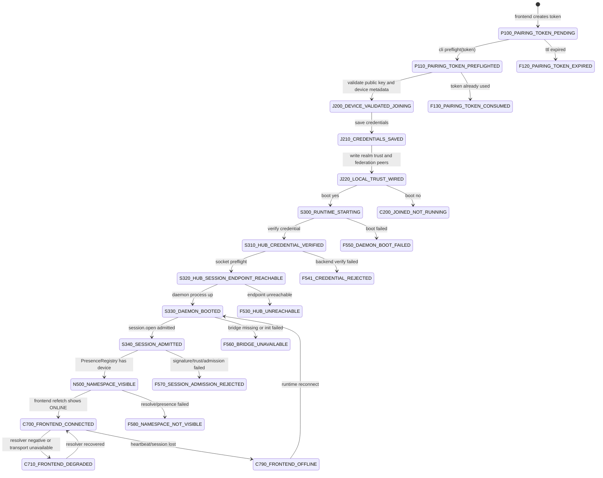
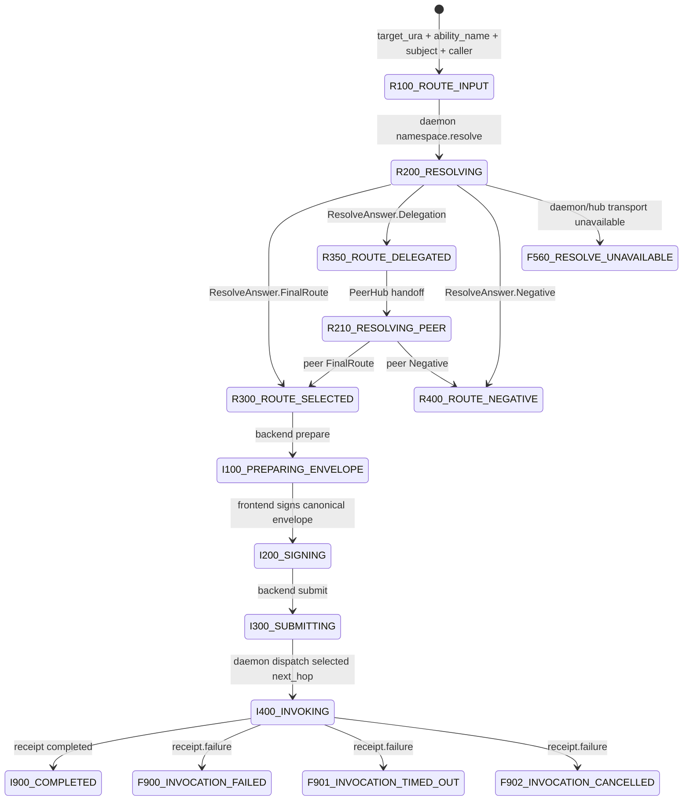
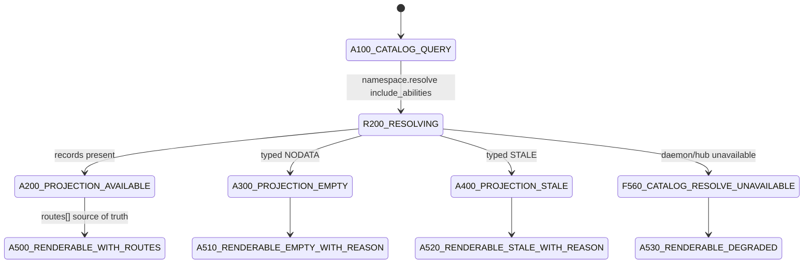
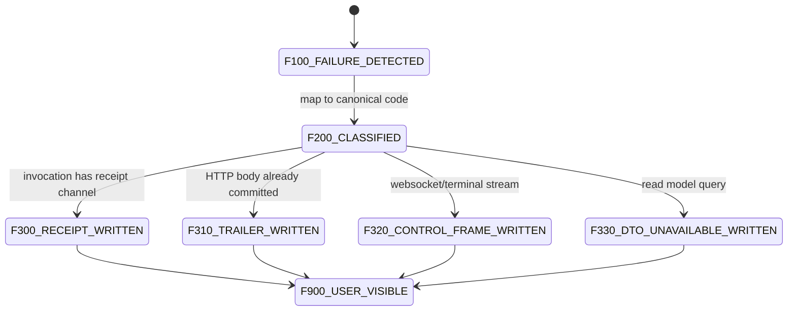
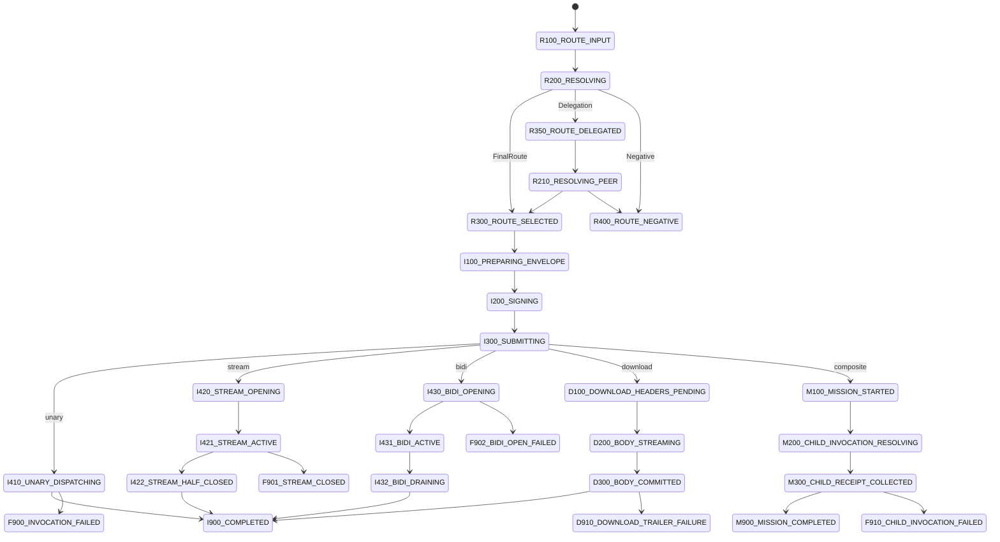
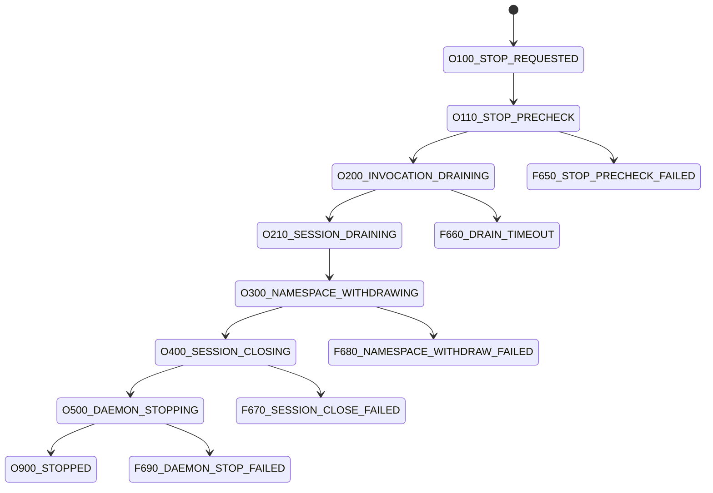
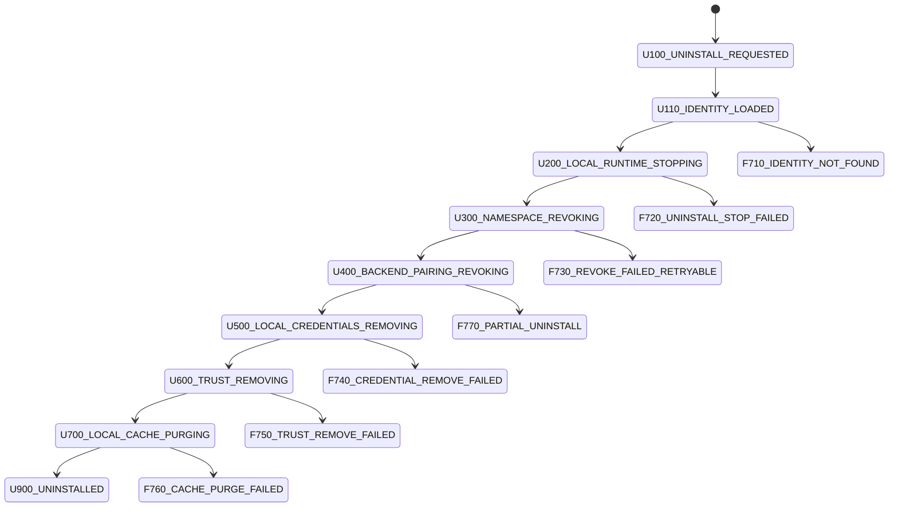

# EasyNet 状态机器完整设计

日期: 2026-06-09  
状态: latest-only clean target  
适用仓库: EasyNet-Axon, EasyNet-Cli, EasyNet Backend, EasyNet Frontend  
目标: 用户拿到 token 后从 `easynet join` 到前端显示 connected 的全链路状态可查、失败可追踪、route 可证明。

## 0. 结论

当前问题不是单一页面、单一 ability 或单一 HTTP handler 的实现 bug, 而是 RFC-005 URA namespace resolution 迁移尚未完全收敛后的系统性状态机器缺口。

必须统一成一条产品不变量:

```text
credential accepted != daemon connected != namespace visible != frontend connected
```

另一个不变量:

```text
bare ability name 只能作为 resolver query input;
signed Invocation 和 backend prepare/submit 必须使用 ResolveAnswer.FinalRoute 里的 canonical ability_ura, route_ura, dispatch_name, next_hop。
```

因此 clean target 是:

1. Axon 拥有 URA grammar, resolver answer, negative taxonomy, route evidence, receipt failure protocol。
2. CLI daemon 拥有 device-local runtime, bridge/session admission, namespace.resolve 产品调用面, resolve-before-invoke dispatch。
3. Backend 拥有 product DB/read model/HTTP projection, 但不推断 canonical ability route。
4. Frontend 拥有 UI 状态渲染, 但不推断 owner、callee、host placement 或 ability route。
5. `easynet doctor`, `easynet runtime status`, `easynet docker doctor/status`, Backend DTO, Frontend UI 必须共享同一组状态码和 failure locator。

## 1. 仓库边界

| 层 | 应拥有 | 不应拥有 |
| --- | --- | --- |
| EasyNet-Axon proto/domain/runtime | URA 语法, `ResolveQuery`, `ResolveAnswer`, route evidence, negative answer taxonomy, failure code, `InvocationReceipt.failure` | Backend 产品 DB, Frontend UX, CLI 本地插件实现 |
| EasyNet-Cli daemon | local device abilities, hosted agent runtime, Axon bridge/session, device namespace authority, resolve-before-invoke, local receipt producer | Backend HTTP policy, Frontend connected 判定 |
| EasyNet Backend | pairing lifecycle, credential issuance, user ownership, read model projection, typed unavailable DTO, signed invoke prepare/submit facade | URA canonicalization fork, owner/route inference, Axon resolver negative 字符串解析 |
| EasyNet Frontend | token UX, SSE cache invalidation, typed state rendering, actionable error display | liveness truth, ability route builder, resolver fallback |

边界判断:

- Backend 调 daemon.sock 或 Hub ability 是合法 transport-binding。
- Backend 在 Go 里重新实现 envelope canonicalization, admission, URA grammar, delegation, session authority, enum 表是不合格 protocol fork。
- Frontend 根据 device id 拼 `easynet:///r/<realm>/ability/device.<id>.<name>` 只能作为临时过渡, clean target 必须删除。

## 2. 状态码命名规则

状态码是产品和工程共同语言:

| 前缀 | 语义 |
| --- | --- |
| `P` | Pairing token lifecycle |
| `J` | Join credential lifecycle |
| `S` | Session/runtime lifecycle |
| `N` | Namespace visibility/readiness |
| `C` | Frontend connected/degraded UI |
| `R` | Resolver route selection |
| `I` | Invocation prepare/submit/execution |
| `M` | Mission/EAL composite invocation orchestration |
| `D` | Download/body-committed stream lifecycle |
| `O` | Operator runtime stop lifecycle |
| `U` | Self-uninstall/leave lifecycle |
| `A` | Ability catalog/read model |
| `F` | Failure terminal or degraded state |

状态码必须满足:

- 稳定: UI、CLI、日志、测试不得依赖人类字符串。
- 可定位: 每个 failure 必须带 `transition`, `from_state`, `to_state` 或 `interrupted_state`。
- 可追踪: failure 必须带 `source`, `layer`, `code`, `message`, `retryable`, `evidence`。
- 可组合: 同一个页面可以同时有 product read model rows 和 `resolve_unavailable[]`。

## 3. Join 到 Connected 状态机器

### 3.1 状态图



### 3.2 状态表

| Code | State | Owner | Meaning | User visible | Terminal |
| --- | --- | --- | --- | --- | --- |
| `P100` | `PAIRING_TOKEN_PENDING` | Backend | token 已创建, hash 已保存, TTL 生效 | 前端显示 CLI 命令 | No |
| `P110` | `PAIRING_TOKEN_PREFLIGHTED` | Backend/CLI | CLI 证明持有 token, 取得 reserved node/trust material | CLI preflight 通过 | No |
| `F120` | `PAIRING_TOKEN_EXPIRED` | Backend | token 过期 | 前端/CLI 报 token expired | Yes |
| `F130` | `PAIRING_TOKEN_CONSUMED` | Backend | token 已被使用或状态非 pending | CLI 报 token consumed | Yes |
| `J200` | `DEVICE_VALIDATED_JOINING` | Backend | credential issued, DB 状态 validated, liveness 未证明 | CLI 显示 pairing accepted | No |
| `J210` | `CREDENTIALS_SAVED` | CLI | credential/config/key material 已落本地 | doctor 可查 | No |
| `J220` | `LOCAL_TRUST_WIRED` | CLI | realm trust 和 federation peer 写入完成 | doctor 可查 | No |
| `S300` | `RUNTIME_STARTING` | CLI | 正在启动 daemon | CLI/runtime status 可查 | No |
| `S310` | `HUB_CREDENTIAL_VERIFIED` | CLI/Backend | Backend 接受 credential token | doctor 可查 | No |
| `S320` | `HUB_SESSION_ENDPOINT_REACHABLE` | CLI | Hub session endpoint TCP/TLS 可达 | doctor 可查 | No |
| `S330` | `DAEMON_BOOTED` | CLI | daemon.sock up, runtime process alive | doctor 显示 daemon up | No |
| `S340` | `SESSION_ADMITTED` | CLI daemon/Hub | `session.open` admission 成功, Hub 认可 device identity | doctor 显示 session admitted | No |
| `N500` | `NAMESPACE_VISIBLE` | Axon/Hub/CLI | device URA 已进入 resolver/PresenceRegistry 可见面 | backend resolve 正向 | No |
| `C700` | `FRONTEND_CONNECTED` | Backend/Frontend | 后端 read model 投影 ONLINE, 前端显示 connected | Yes | No |
| `C710` | `FRONTEND_DEGRADED` | Backend/Frontend | DB row 可显示, runtime resolver 有 typed unavailable | Yes | No |
| `C790` | `FRONTEND_OFFLINE` | Backend/Frontend | session/heartbeat lost, 或 PresenceRegistry 不含该 device | Yes | No |

### 3.3 Failure 表

| Code | Failure | Interrupted transition | Source | Retryable | Operator action |
| --- | --- | --- | --- | --- | --- |
| `F530` | `HUB_UNREACHABLE` | `S310 -> S320` | CLI socket preflight | Yes | 检查 Hub TLS endpoint, port, trust, compose |
| `F541` | `CREDENTIAL_REJECTED` | `S300 -> S310` | Backend credential verify | No/Maybe | 重新 join 或刷新 credential |
| `F550` | `DAEMON_BOOT_FAILED` | `S300 -> S330` | CLI daemon supervisor | Maybe | 看 daemon log |
| `F560` | `BRIDGE_UNAVAILABLE` | `S330 -> S340` | CLI Axon bridge loader | Yes after config | 设置 `EASYNET_DENDRITE_BRIDGE_LIB/HOME` 或安装 bridge |
| `F570` | `SESSION_ADMISSION_REJECTED` | `S340 admission` | Hub admission/Axon | No/Maybe | 检查 caller signature, trusted key, realm trust |
| `F580` | `NAMESPACE_NOT_VISIBLE` | `S340 -> N500` | resolver/PresenceRegistry | Yes | 检查 session 是否真的 admitted, 不是仅 daemon up |

用户给出的错误:

```text
pairing credentials were saved, but daemon startup failed
bridge: dendrite bridge library not found
```

应记录为:

```json
{
  "state_code": "F560",
  "state": "BRIDGE_UNAVAILABLE",
  "transition": "S330_DAEMON_BOOTED -> S340_SESSION_ADMITTED",
  "source": "cli.axon_bridge.loader",
  "layer": "runtime",
  "retryable": true,
  "message": "dendrite bridge library not found",
  "operator_hint": "set EASYNET_DENDRITE_BRIDGE_LIB or EASYNET_DENDRITE_BRIDGE_HOME"
}
```

### 3.4 产品逻辑

`easynet join` 成功保存 credential 后, 如果 `--boot yes` 默认启动 daemon, daemon 无法连接 Hub/Axon bridge/session 时必须失败退出。不能沉默成功, 因为用户此时期待前端 connected。

如果用户传 `--boot no`, join 可以停在 `C200_JOINED_NOT_RUNNING`, 但 doctor 必须显示:

```text
state_code: C200
transition_needed: J220_LOCAL_TRUST_WIRED -> S300_RUNTIME_STARTING
next_action: easynet runtime start
```

Frontend 只应在 Backend read model 从 resolver/PresenceRegistry 得到 active evidence 后显示 connected。`JOINING`、`UNKNOWN`、`DEGRADED` 都不能计为 online liveness。

## 4. Namespace Resolve / Invoke 状态机器

### 4.1 状态图



### 4.2 Resolve 状态表

| Code | State | Owner | Required data | Allowed next |
| --- | --- | --- | --- | --- |
| `R100` | `ROUTE_INPUT` | Backend/Frontend/CLI caller | `target_ura`, `ability_name` or full ability URA, `caller`, `subject`, `scope` | `R200`, `R400` |
| `R200` | `RESOLVING` | CLI daemon/Axon | normalized `ResolveQuery` | `R300`, `R350`, `R400`, `F560` |
| `R210` | `RESOLVING_PEER` | Hub/Axon peer | delegation proof, authoritative realm | `R300`, `R400`, `F560` |
| `R300` | `ROUTE_SELECTED` | Axon | `ResolveAnswer.FinalRoute` with selected next hop | `I100` |
| `R350` | `ROUTE_DELEGATED` | Axon | peer hub delegation, no local dispatch | `R210` |
| `R400` | `ROUTE_NEGATIVE` | Axon | `NegativeReason`, code, retry policy | terminal for this attempt |
| `F560` | `RESOLVE_UNAVAILABLE` | CLI/Backend | transport/runtime failure locator | terminal/degraded |

### 4.3 Invocation 状态表

| Code | State | Owner | Invariant |
| --- | --- | --- | --- |
| `I100` | `PREPARING_ENVELOPE` | Backend | 只能使用 `R300.selected_route.ability_ura`, 不拼 canonical URA |
| `I200` | `SIGNING` | Frontend/client key | 签名输入必须是 backend prepared canonical envelope |
| `I300` | `SUBMITTING` | Backend | submit body 必须携带 route evidence/hash 或 resolve answer id |
| `I400` | `INVOKING` | CLI daemon/Axon runtime | dispatch only with resolver-selected next hop |
| `I900` | `COMPLETED` | Runtime producer | `InvocationReceipt.state=Completed`, 不带 failure |
| `F900` | `INVOCATION_FAILED` | Runtime producer | `InvocationReceipt.failure` 必须 populated |
| `F901` | `INVOCATION_TIMED_OUT` | Runtime producer | timeout reason 写入 typed failure |
| `F902` | `INVOCATION_CANCELLED` | Runtime producer | cancellation reason 写入 typed failure |

## 5. Ability Catalog / Read Model 状态机器

### 5.1 状态图



### 5.2 Catalog 规则

| Rule | Requirement |
| --- | --- |
| Catalog authority | device-local namespace authority; Hub stores signed projection/read model |
| Backend source | typed `ResolveAnswer.records`, not host placement inference |
| Frontend source | API `routes[]` and `resolve_unavailable[]`, not local route construction |
| Empty list | only healthy when resolver returns positive empty or typed `NODATA` |
| Failure | `resolve_unavailable[]` must be populated for runtime/transport/negative failure |

用户看到的:

```text
meta.list_resources: no canonical ability route for device ...
BAD_REQUEST: ability_ura is required; select a resolver catalog route
```

说明某些 call site 仍停在 `A100 -> local inference -> I100`, 跳过了 `R200 -> R300`。这不是单一 ability 的问题, 是 read model 和 invoke prepare 未全面迁到 resolver route contract。

## 6. Failure Propagation 状态机器

### 6.1 状态图



### 6.2 Failure locator 结构

```json
{
  "code": "TARGET_NOT_IN_PRESENCE_REGISTRY",
  "state_code": "F570",
  "source": "daemon_grpc.invoke_remote",
  "layer": "admission",
  "transition": "I300_SUBMITTING -> I400_INVOKING",
  "from_state": "I300_SUBMITTING",
  "interrupted_state": "I400_INVOKING",
  "message": "target device is not in PresenceRegistry",
  "retryable": true,
  "retry_after_unix_ms": 1780887355000,
  "evidence": {
    "target_ura": "easynet:///r/localhost/device/<id>",
    "ability_ura": "easynet:///r/localhost/ability/device.<id>.terminal.list",
    "trace": "<trace-id>",
    "span": "<span-id>"
  }
}
```

### 6.3 Transport-specific projection

| Surface | Failure carrier | Rule |
| --- | --- | --- |
| Unary HTTP before response | JSON `{error, failure}` | status code may be 4xx/5xx, but product reason must be typed |
| HTTP read model | `resolve_unavailable[]` | never return healthy empty list when resolver failed |
| HTTP download after headers | `X-EasyNet-Failure` trailer | base64url JSON `FailureLocator`, body remains octet-stream |
| WebSocket terminal | `terminal_error` control frame | frontend renders typed code/source/message |
| Invocation receipt | `InvocationReceipt.failure` | every Failed/TimedOut/Cancelled receipt writes typed failure |

## 7. Core Data Structures

### 7.1 ResolveQuery

```json
{
  "target_ura": "easynet:///r/localhost/device/<device-id>",
  "ability_name": "terminal.list",
  "subject_ura": "easynet:///r/localhost/user/<user-id>",
  "caller_ura": "easynet:///r/localhost/user/<user-id>",
  "scope": "TargetOwner",
  "include_abilities": false,
  "release_profile_min": "AuthoritativeLocal"
}
```

### 7.2 ResolveAnswer.FinalRoute

```json
{
  "answer_kind": "FinalRoute",
  "selected_route": {
    "callee_ura": "easynet:///r/localhost/device/<device-id>",
    "ability_ura": "easynet:///r/localhost/ability/device.<device-id>.terminal.list",
    "route_ura": "easynet:///r/localhost/route/<route-id>",
    "dispatch_name": "terminal.list",
    "next_hop": {
      "kind": "LocalDeviceAbility",
      "target_ura": "easynet:///r/localhost/device/<device-id>"
    }
  },
  "route_evidence": {
    "authority": "namespace.resolve",
    "selection_algorithm": "deterministic-weighted",
    "selection_seed_hash": "sha256:...",
    "profile": "Production"
  },
  "cache_policy": {
    "ttl_ms": 1000,
    "stale_while_revalidate_ms": 5000
  }
}
```

### 7.3 ResolveAnswer.Negative

```json
{
  "answer_kind": "Negative",
  "negative": {
    "reason": "NOROUTE",
    "code": "TARGET_NOT_IN_PRESENCE_REGISTRY",
    "layer": "route",
    "message": "target device is offline or not admitted",
    "retryable": true
  }
}
```

### 7.4 Backend read model DTO

```json
{
  "items": [],
  "routes": [],
  "resolve_unavailable": [
    {
      "source": "namespace.resolve",
      "reason": "NOROUTE",
      "query_name": "terminal.list",
      "message": "target device is not in PresenceRegistry",
      "code": "TARGET_NOT_IN_PRESENCE_REGISTRY",
      "stage": "resolve",
      "retryable": true
    }
  ]
}
```

### 7.5 Local connection snapshot

```json
{
  "state_code": "F560",
  "state": "BRIDGE_UNAVAILABLE",
  "phase": "runtime",
  "transition": "S330_DAEMON_BOOTED -> S340_SESSION_ADMITTED",
  "realm": "localhost",
  "device_ura": "easynet:///r/localhost/device/<device-id>",
  "hub_endpoint": "https://127.0.0.1:50443",
  "updated_at_unix_ms": 1780974000000,
  "failure": {
    "code": "BRIDGE_LIBRARY_NOT_FOUND",
    "source": "cli.axon_bridge.loader",
    "retryable": true,
    "message": "dendrite bridge library not found"
  }
}
```

## 8. Doctor / Status 输出契约

`easynet doctor` 必须展示:

| Field | Required |
| --- | --- |
| `state_code` | stable product state code |
| `state` | human-readable state |
| `phase` | pairing/join/runtime/namespace/frontend/invoke |
| `transition` | last completed or interrupted transition |
| `failure.code` | canonical failure code if failed/degraded |
| `failure.source` | source component |
| `failure.retryable` | operator can retry or must rejoin |
| `next_action` | concrete command or remediation |

示例:

```text
EasyNet doctor

  - device pairing       paired as c130295e-9682-499e-bc09-72d4678a5887
  - local runtime        failed
      state_code: F560
      state: BRIDGE_UNAVAILABLE
      transition: S330_DAEMON_BOOTED -> S340_SESSION_ADMITTED
      reason: bridge library not found
      next: set EASYNET_DENDRITE_BRIDGE_LIB or EASYNET_DENDRITE_BRIDGE_HOME, then run easynet runtime start
  - federation           peers configured, namespace not visible
```

`doctor --json` 需要输出同一对象, 不另建一套字段。

## 9. HTTP / Frontend 状态渲染契约

### 9.1 HTTP 状态

| Case | HTTP status | Body rule |
| --- | --- | --- |
| resolver typed negative for list/read model | 200 | rows plus `resolve_unavailable[]`, unless request itself invalid |
| missing canonical ability route in invocation prepare | 400 | typed `failure` with `R400` or `F560`, not bare `ability_ura is required` |
| target offline during invoke | 409 or 503 | typed `failure`, code `TARGET_NOT_IN_PRESENCE_REGISTRY` |
| unauthorized policy | 403 | typed negative `UNAUTHORIZED` |
| healthy empty list | 200 | empty rows and no `resolve_unavailable[]` |

### 9.2 Frontend 渲染

| API field | UI state |
| --- | --- |
| `state=ONLINE` and no blocking unavailable | connected |
| `state=JOINING` | joining, not online |
| `state=UNKNOWN` | degraded/unknown, not online |
| `resolve_unavailable[].retryable=true` | degraded with retry hint |
| `resolve_unavailable[].reason=UNAUTHORIZED` | permission denied |
| `failure.state_code` | show exact operator code |

Frontend 禁止:

- 从 device id 拼 canonical ability URA。
- 根据 URL path 推断 `ability_ura`。
- 将 resolver failure 当健康空列表。
- 把 `JOINING` 算作 connected。

## 10. Invocation 全量变体矩阵

### 10.1 维度

`invoke` 不是一个单一路径, 而是 resolver-selected route 加 transport profile 的组合。完整状态机必须覆盖三个维度:

| Dimension | Values | Contract |
| --- | --- | --- |
| Locality | same device, same realm remote device, cross realm peer, hosted agent, hub/system ability | caller 不能从 locality 推断 route, 必须看 `ResolveAnswer.FinalRoute.next_hop` |
| Tenant boundary | same user, cross user same realm, cross user cross realm, service/system subject | policy result 必须进入 resolve answer 或 admission failure, 不能在 frontend 静默过滤 |
| Transport profile | unary, streaming, bidi, terminal/websocket, download-after-commit, Mission/EAL composite | transport 只能改变 failure carrier, 不能改变 canonical failure shape |

### 10.2 Route variants

| Variant | Predicate | Resolver answer | Dispatch next hop | Required policy | Canonical failures |
| --- | --- | --- | --- | --- | --- |
| `V0_LOCAL_SAME_DEVICE` | caller, subject, callee 在同一 device runtime | `FinalRoute(LocalDeviceAbility)` | local ability registry | local device ownership/session admitted | `NXDOMAIN`, `NODATA`, `UNAUTHORIZED`, `RECEIPT_FAILURE_MISSING` |
| `V1_SAME_REALM_SAME_USER_REMOTE_DEVICE` | 同 realm、同 user、目标 device 在线 | `FinalRoute(RemoteDeviceAbility)` | hub `runtime.invoke_remote` to target device | target in PresenceRegistry, same owner or explicit grant | `TARGET_NOT_IN_PRESENCE_REGISTRY`, `NOROUTE`, `STALE` |
| `V2_SAME_REALM_CROSS_USER` | 同 realm、跨 user 访问共享资源/授权 ability | `FinalRoute(RemoteDeviceAbility)` or `Negative(UNAUTHORIZED)` | hub remote route | ACL/delegation grant, subject key registered | `UNAUTHORIZED`, `SUBJECT_KEY_UNREGISTERED`, `DELEGATION_INVALID` |
| `V3_CROSS_REALM` | target realm != caller realm | `Delegation` then peer `FinalRoute` | trusted peer hub | realm trust, peer hub reachable, delegation proof | `REALM_NOT_TRUSTED`, `PEER_HUB_UNAVAILABLE`, `DELEGATION_REQUIRED`, `DELEGATION_INVALID` |
| `V4_HOSTED_AGENT_LOCAL_DEVICE` | ability belongs to agent hosted on local device | `FinalRoute(HostedAgentAbility)` | local agent runtime | agent advertised and admitted | `AGENT_NOT_ADVERTISED`, `AGENT_NOT_RUNNING`, `NOROUTE` |
| `V5_HOSTED_AGENT_REMOTE_DEVICE` | hosted agent on remote device | `FinalRoute(RemoteHostedAgentAbility)` | hub to owning daemon then agent runtime | target device online, agent advertised | `TARGET_NOT_IN_PRESENCE_REGISTRY`, `AGENT_NOT_ADVERTISED`, `OVERLOADED` |
| `V6_HUB_OR_SYSTEM_ABILITY` | hub/system-owned namespace/runtime/federation ability | `FinalRoute(HubAbility/SystemAbility)` | hub local ability | system role, caller authority | `UNAUTHORIZED`, `ABILITY_QUERY_CONFLICT`, `THROTTLED` |
| `V7_BACKEND_PUBLIC_RESOURCE` | pages/files/openai 等产品资源, runtime callee 是 host device/hub | `FinalRoute(ProductResourceRoute)` | route-selected host, not guessed backend route | resource ACL, host liveness | `ROUTE_PROFILE_NOT_AUTHORITATIVE`, `AGENT_NOT_ADVERTISED`, `NOROUTE` |

### 10.3 Policy matrix

| Caller/subject case | Same realm | Cross realm | Required evidence |
| --- | --- | --- | --- |
| Same user, same device | local positive route | delegation not needed | device credential, session id |
| Same user, remote device | remote positive route if online | peer positive route if trusted | ownership ledger, target presence |
| Cross user, explicit share | positive route only with grant | peer route only with cross-realm grant | grant id, subject URA, caller signature |
| Cross user, no grant | `Negative(UNAUTHORIZED)` | `Negative(UNAUTHORIZED)` or `REALM_NOT_TRUSTED` | policy denial evidence |
| System/service caller | system route if role allowed | trusted system delegation | service identity, role proof |

### 10.4 Invoke state graph



### 10.5 Transport sub-state machines

| Profile | States | Failure carrier | Rule |
| --- | --- | --- | --- |
| Unary | `I100 -> I200 -> I300 -> I410 -> I900/F900` | HTTP JSON or `InvocationReceipt.failure` | response not committed, failure can be normal typed body |
| Server stream | `I420 -> I421 -> I422 -> I900/F901` | receipt failure or stream control frame | stream close reason must be typed, not inferred by EOF |
| Bidi stream | `I430 -> I431 -> I432 -> I900/F902` | receipt failure plus bidi control frame | open failure and midstream failure are distinct codes |
| Terminal/WebSocket | `I420/I430 -> I421/I431 -> F320/I900` | `terminal_error` control frame | frontend displays code/source/message |
| Download after commit | `D100 -> D200 -> D300 -> I900/D910` | `X-EasyNet-Failure` trailer | if body already committed, trailer carries base64url `FailureLocator` |
| Mission/EAL composite | `M100 -> M200 -> M300 -> M900/F910` | parent receipt with child failures | child invocation failure must be preserved, not flattened |

## 11. Stop 状态机器

`runtime stop` 是 operator lifecycle, 不是 unpair。它必须停止本地 daemon/session 并撤销 namespace 可见性, 但保留 credential、trust 和 pairing identity。



| Code | State | Owner | Invariant |
| --- | --- | --- | --- |
| `O100` | `STOP_REQUESTED` | CLI | user requested runtime stop |
| `O110` | `STOP_PRECHECK` | CLI daemon | load local runtime identity; no network-heavy inference |
| `O200` | `INVOCATION_DRAINING` | CLI daemon | in-flight invocations get completed/cancelled receipts |
| `O210` | `SESSION_DRAINING` | CLI daemon/Axon bridge | stop accepting new remote invocations |
| `O300` | `NAMESPACE_WITHDRAWING` | CLI daemon/Hub | withdraw advertised abilities/presence |
| `O400` | `SESSION_CLOSING` | CLI daemon/Hub | close admitted session with reason `operator_stop` |
| `O500` | `DAEMON_STOPPING` | CLI supervisor | daemon process exits or is killed after timeout |
| `O900` | `STOPPED` | CLI | daemon stopped; credential remains |
| `F650` | `STOP_PRECHECK_FAILED` | CLI | local runtime identity/config unreadable |
| `F660` | `DRAIN_TIMEOUT` | CLI daemon | in-flight drain exceeded timeout; pending receipts must be cancelled |
| `F670` | `SESSION_CLOSE_FAILED` | CLI daemon/Hub | close failed; local stop may continue but state is degraded |
| `F680` | `NAMESPACE_WITHDRAW_FAILED` | CLI daemon/Hub | namespace visibility may be stale; doctor must show interrupted transition |
| `F690` | `DAEMON_STOP_FAILED` | CLI supervisor | process did not stop |

`doctor` after a successful stop must report `O900 STOPPED` and `transition_needed: O900_STOPPED -> S300_RUNTIME_STARTING`, not `unpaired` and not `connected`。

## 12. Self Uninstall / Leave 状态机器

`self uninstall`/`leave` 是 identity lifecycle。它撤销本地 device identity、trust material、cached projections 和 backend pairing, 与 `runtime stop` 不同。clean target 不兼容旧的静默清理: 部分失败必须可见且可恢复。



| Code | State | Owner | Invariant |
| --- | --- | --- | --- |
| `U100` | `UNINSTALL_REQUESTED` | CLI | explicit user request; destructive operation requires product confirmation upstream |
| `U110` | `IDENTITY_LOADED` | CLI | load device id, realm, credential paths, trust paths |
| `U200` | `LOCAL_RUNTIME_STOPPING` | CLI | reuse stop state machine; no live session may remain advertised |
| `U300` | `NAMESPACE_REVOKING` | CLI daemon/Hub | remove presence/ability advertisements and revoke namespace authority |
| `U400` | `BACKEND_PAIRING_REVOKING` | Backend | mark device pairing revoked/removed with typed reason |
| `U500` | `LOCAL_CREDENTIALS_REMOVING` | CLI | delete device credential/private local config |
| `U600` | `TRUST_REMOVING` | CLI | remove realm trust files if no other local identity needs them |
| `U700` | `LOCAL_CACHE_PURGING` | CLI | purge read model/session/invocation cache for this identity |
| `U900` | `UNINSTALLED` | CLI/Backend | local identity cannot invoke; frontend shows removed/unpaired |
| `F710` | `IDENTITY_NOT_FOUND` | CLI | idempotent only if user requested `--allow-missing`; otherwise visible |
| `F720` | `UNINSTALL_STOP_FAILED` | CLI | stop failed; do not delete credentials while runtime may still advertise |
| `F730` | `REVOKE_FAILED_RETRYABLE` | CLI/Hub | network/backend revoke failed; local cleanup must pause or mark partial |
| `F740` | `CREDENTIAL_REMOVE_FAILED` | CLI | local credential deletion failed |
| `F750` | `TRUST_REMOVE_FAILED` | CLI | trust cleanup failed |
| `F760` | `CACHE_PURGE_FAILED` | CLI | cache cleanup failed, identity already revoked |
| `F770` | `PARTIAL_UNINSTALL` | CLI/Backend | some irreversible steps completed; doctor must show remaining cleanup |

## 13. Canonical Failure Code Catalog

| Category | Codes | Must surface in |
| --- | --- | --- |
| Pairing/join/runtime | `PAIRING_TOKEN_EXPIRED`, `PAIRING_TOKEN_CONSUMED`, `HUB_UNREACHABLE`, `CREDENTIAL_REJECTED`, `DAEMON_BOOT_FAILED`, `BRIDGE_LIBRARY_NOT_FOUND`, `SESSION_ADMISSION_REJECTED`, `NAMESPACE_NOT_VISIBLE` | `easynet join`, `doctor`, backend device DTO |
| Resolver negative | `ABILITY_QUERY_CONFLICT`, `NXDOMAIN`, `NODATA`, `NOROUTE`, `UNAUTHORIZED`, `STALE`, `THROTTLED`, `OVERLOADED`, `ROUTE_PROFILE_NOT_AUTHORITATIVE` | `ResolveAnswer.Negative`, read model DTO |
| Routing/tenant | `REALM_NOT_TRUSTED`, `PEER_HUB_UNAVAILABLE`, `DELEGATION_REQUIRED`, `DELEGATION_INVALID`, `SUBJECT_KEY_UNREGISTERED`, `CALLER_SIGNATURE_INVALID`, `TARGET_NOT_IN_PRESENCE_REGISTRY`, `AGENT_NOT_ADVERTISED`, `AGENT_NOT_RUNNING` | resolver answer, invocation receipt |
| Invocation transport | `STREAM_OPEN_FAILED`, `STREAM_CLOSED`, `BIDI_OPEN_FAILED`, `DOWNLOAD_TRAILER_FAILURE`, `RECEIPT_FAILURE_MISSING`, `CHILD_INVOCATION_FAILED` | receipt, trailer, websocket control frame |
| Stop lifecycle | `STOP_PRECHECK_FAILED`, `DRAIN_TIMEOUT`, `SESSION_CLOSE_FAILED`, `NAMESPACE_WITHDRAW_FAILED`, `DAEMON_STOP_FAILED` | `runtime stop`, `doctor --json` |
| Self-uninstall lifecycle | `IDENTITY_NOT_FOUND`, `UNINSTALL_STOP_FAILED`, `REVOKE_FAILED_RETRYABLE`, `CREDENTIAL_REMOVE_FAILED`, `TRUST_REMOVE_FAILED`, `CACHE_PURGE_FAILED`, `PARTIAL_UNINSTALL` | `self uninstall/leave`, `doctor --json` |

Failure code 与状态码不是同一个字段: 状态码定位 state/transition, failure code 解释协议或产品原因。例如 `F900 INVOCATION_FAILED` 可以携带 `TARGET_NOT_IN_PRESENCE_REGISTRY`, `UNAUTHORIZED`, `AGENT_NOT_ADVERTISED` 等不同 failure code。

## 14. 治本更新计划

### Phase 1: Axon contract finalization

目标:

- `ResolveAnswer` 字段作为唯一 wire/product route contract。
- `FinalRoute` 必须携带 `ability_ura`, `route_ura`, `dispatch_name`, `next_hop`, evidence。
- `Negative` 必须覆盖 `NXDOMAIN`, `NODATA`, `NOROUTE`, `UNAUTHORIZED`, `STALE`, `THROTTLED`, `OVERLOADED`, `ABILITY_QUERY_CONFLICT`。
- `InvocationReceipt.failure` 覆盖 Failed/TimedOut/Cancelled。

验收:

- proto parity check pass。
- Go/Rust SDK conformance pass。
- runtime negative answer 和 receipt failure 有 fixture。

### Phase 2: CLI daemon resolve-before-invoke

目标:

- 所有 local/remote invoke path 都先 `namespace.resolve`。
- dispatch 只消费 resolver-selected next hop。
- CLI ability catalog store 降级为 projection/read model, 不再作为 route authority。
- `easynet doctor` 输出 connection snapshot 和 interrupted transition。

验收:

- `meta.list_resources`, `terminal.list`, `browser.*`, `remote_desktop.*`, `fs.*` 不再出现 "no canonical ability route"。
- `cargo test --features axon-pb` 覆盖 resolve-before-invoke。

### Phase 3: Backend route facade cleanup

目标:

- 新增或收口 `ResolveInvokeRoute` facade。
- prepare envelope 调 daemon `namespace.resolve`, 使用 `ResolveAnswer.FinalRoute`。
- 删除长期 `canonicalDeviceAbilityRoute` 和 owner inference fallback。
- invocation history/list 不因缺 `ability_ura` 返回裸 400, 必须返回 typed route failure。

验收:

- `rg "canonicalDeviceAbilityRoute|DeviceOwnedAbilityURAForTarget|ability_ura is required"` 不命中长期路径。
- `/api/v1/invocations/history/list` 对 device route 使用 catalog route 或 typed failure。

### Phase 4: Backend read model typed unavailable

目标:

- `/devices`, `/devices/:id`, `/devices/:id/abilities`, `/agents`, `/skills`, `/pages`, `/calls`, `/invocations/history/list` 全部保留 typed unavailable。
- resolver/hub failure 不返回健康空列表。
- 只有输入参数本身非法才是普通 400。

验收:

- 对 `AGENT_NOT_ADVERTISED`, `TARGET_NOT_IN_PRESENCE_REGISTRY`, daemon unavailable 有 API tests。
- Frontend API tests 覆盖 `resolve_unavailable[]`。

### Phase 5: Frontend route source cleanup

目标:

- ability/detail/history/action 按 API routes[] 或 selected route id 调用。
- UI 显示 route/failure state code。
- 下载 client 解码 `X-EasyNet-Failure` trailer。

验收:

- 没有 frontend owner/canonical ability inference。
- Safari/Chrome 下载失败状态可显示 typed reason。

### Phase 6: Receipt producer consolidation

目标:

- terminal/file/browser/remote desktop/openai pages 等 producer 统一写 `InvocationReceipt.failure`。
- HTTP body committed 后用 trailer/control frame。
- RFC-005 failure code 逐步细化, 但外层 shape 不变。

验收:

- Failed/TimedOut/Cancelled receipt 不允许缺 failure。
- Frontend 不解析人类 reason 判断错误类型。

### Phase 7: End-to-end gates

目标:

- docker compose 内重复 join -> connected。
- hub offline, bridge missing, target offline, agent not advertised, unauthorized 五类失败都有状态码。
- doctor 能定位断在哪个 transition。

验收:

- `easynet join` 默认 boot 失败时 exit non-zero。
- `easynet doctor --json` 与 Frontend device state 可交叉定位。
- e2e 覆盖用户提供日志里的 `pages.list`, `terminal.list`, `history/list`, `meta.list_resources`。

### Phase 8: Operator lifecycle gates

目标:

- `runtime stop` 使用 `O*` 状态机, 成功、drain timeout、namespace withdraw failure、daemon stop failure 全部可查。
- `self uninstall/leave` 使用 `U*` 状态机, destructive cleanup 不静默吞 partial failure。
- `doctor --json` 能在 join、invoke、stop、uninstall 四类 lifecycle 中输出同构 `state_code/failure/transition/next_action`。

验收:

- `runtime stop` 成功后状态是 `O900 STOPPED`, credential remains, frontend 不显示 connected。
- self uninstall backend revoke 失败时返回 `F770 PARTIAL_UNINSTALL` 或 `F730 REVOKE_FAILED_RETRYABLE`, 不删除仍可能在线的 credential。
- stop/uninstall e2e 覆盖 repeated command/idempotency/partial cleanup。

## 15. 剩余任务清单

| Priority | Task | Owner repo | Target state |
| --- | --- | --- | --- |
| P0 | CLI daemon 所有 invoke path 统一 resolve-before-invoke | EasyNet-Cli | `R200 -> R300 -> I400` |
| P0 | Backend prepare/submit 删除 canonical ability inference | EasyNet Backend | `R300 -> I100` |
| P0 | `invocations/history/list` 改为 resolver catalog route 或 typed failure | EasyNet Backend/Frontend | no bare 400 |
| P0 | `meta.list_resources` 选择 resolver catalog route | EasyNet-Cli/Backend | no missing route |
| P1 | Frontend 全部 ability action 消费 routes[] | EasyNet Frontend | no owner inference |
| P1 | 下载 client 解码 `X-EasyNet-Failure` trailer | EasyNet Frontend | typed download failure |
| P1 | 所有 terminal receipt producer 写 `InvocationReceipt.failure` | EasyNet-Cli/Axon | typed receipt |
| P1 | `runtime stop` 输出 `O*` 状态码和 interrupted transition | EasyNet-Cli | stop traceable |
| P1 | `self uninstall/leave` 输出 `U*` 状态码和 partial cleanup | EasyNet-Cli/Backend | uninstall traceable |
| P1 | invoke 变体按 route/transport profile 写 fixture | EasyNet-Axon/EasyNet-Cli | complete invoke matrix |
| P2 | RFC-005 failure code taxonomy 细化 | EasyNet-Axon | fewer generic failures |
| P2 | Docker e2e 增加 five-failure matrix | all | regression gate |

## 16. 验收矩阵

| Scenario | Expected state | Expected code |
| --- | --- | --- |
| token expired before CLI validate | `PAIRING_TOKEN_EXPIRED` | `F120` |
| join saved credential but Hub TLS unreachable | `HUB_UNREACHABLE` | `F530` |
| bridge library missing | `BRIDGE_UNAVAILABLE` | `F560` |
| daemon up but session admission rejected | `SESSION_ADMISSION_REJECTED` | `F570` |
| device not in PresenceRegistry on terminal.list | `ROUTE_NEGATIVE` or degraded read model | `TARGET_NOT_IN_PRESENCE_REGISTRY` |
| pages agent not advertised | degraded pages read model | `AGENT_NOT_ADVERTISED` |
| history/list lacks selected route | typed prepare failure | `ABILITY_ROUTE_REQUIRED` or `NOROUTE` |
| healthy empty pages | render empty with no unavailable | no failure |
| failed terminal invocation | receipt failure populated | canonical failure code |
| cross realm untrusted invoke | `ROUTE_NEGATIVE` | `REALM_NOT_TRUSTED` |
| same realm cross-user without grant | `ROUTE_NEGATIVE` | `UNAUTHORIZED` |
| runtime stop success | `STOPPED` | `O900` |
| runtime stop drain timeout | `DRAIN_TIMEOUT` | `F660` |
| self uninstall partial backend revoke failure | `PARTIAL_UNINSTALL` | `F770` |

## 17. 工程审美约束

干净实现不应该通过堆 if/else 消灭症状, 而应该有明确对象边界:

- `ConnectionStateMachine`: CLI-owned local join/runtime/namespace snapshot。
- `ResolveRouteFacade`: Backend-owned product facade over daemon `namespace.resolve`, 只返回 typed route/negative/unavailable。
- `AbilityCatalogRoute`: Backend/Frontend shared DTO route item, 是 UI action 的唯一 route source。
- `FailureLocator`: Axon/CLI/Backend shared failure projection, carrier 可随 transport 变化。
- `InvocationReceiptFailureMapper`: runtime producer side mapper, 把 transport/runtime/admission errors 映射到 canonical receipt failure。

这些对象的职责必须小而硬:

- state machine 只决定状态和 transition, 不做 IO。
- facade 做 IO 和 projection, 不发明 route identity。
- mapper 只分类 failure, 不吞错误。
- read model 可以 degraded, 但必须说清楚为什么 degraded。
